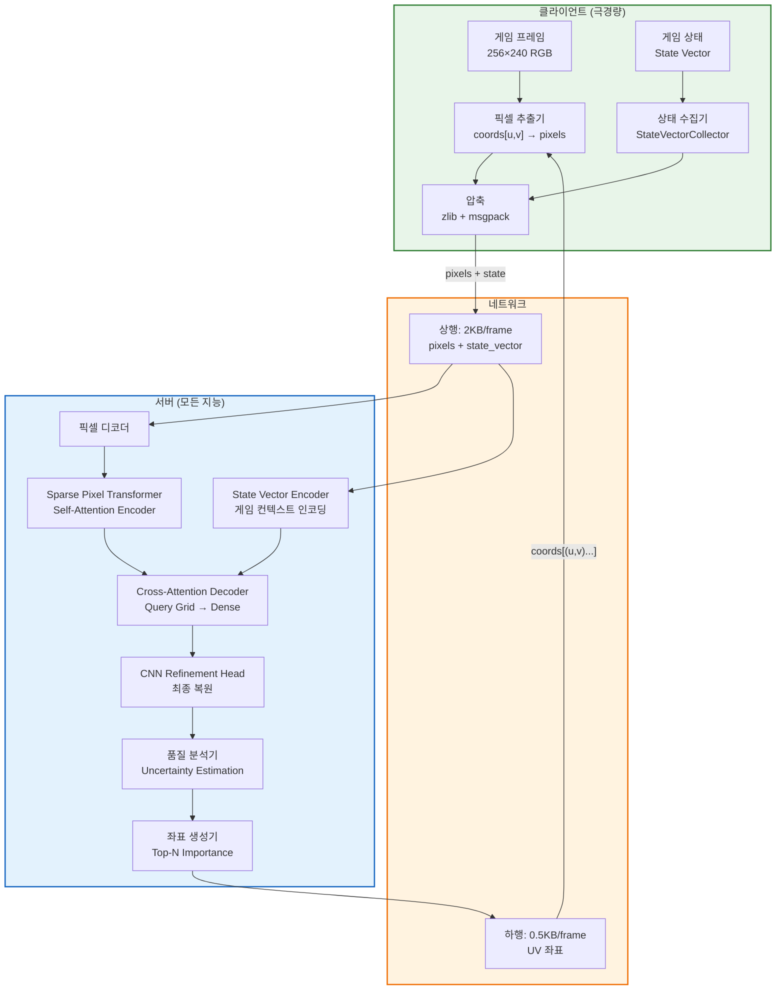
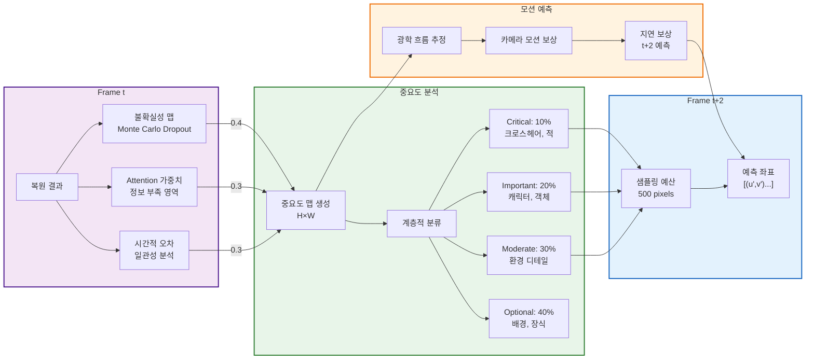
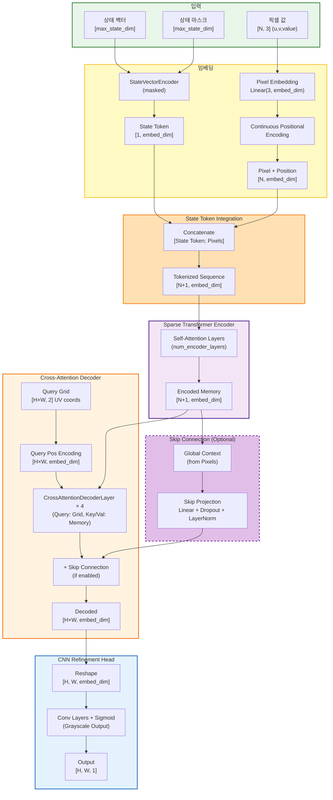
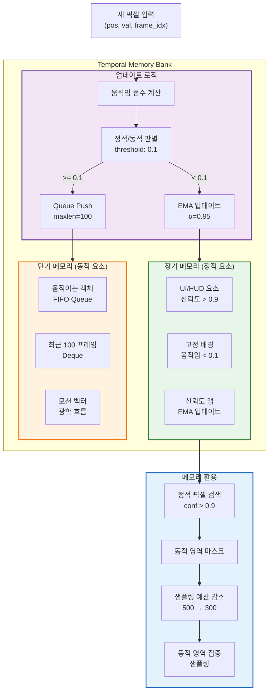
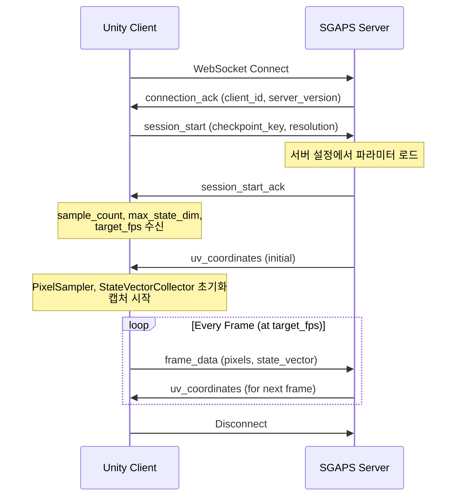

# Server-Guided Adaptive Pixel Sampling MAE (SGAPS-MAE)

## 개요

SGAPS-MAE는 게임 세션 리플레이를 위한 혁신적인 픽셀 단위 적응적 샘플링 시스템입니다. 기존 패치 기반 MAE의 한계를 극복하고, 클라이언트 부하를 최소화하면서도 0.5-2%의 픽셀만으로 전체 프레임을 복원합니다.

### 핵심 혁신

-   **서버 주도 샘플링**: 모든 지능을 서버에 집중, 클라이언트는 단순 픽셀 추출만 수행
-   **픽셀 단위 적응**: 정보량이 높은 픽셀만 선택적 샘플링
-   **실시간 피드백 루프**: 복원 품질 기반 동적 샘플링 최적화
-   **극한 압축**: 250-1000개 픽셀(0.5-2%)만으로 224×224 프레임 복원

## 시스템 아키텍처

### 전체 시스템 구조



### 적응적 픽셀 샘플링 메커니즘



### Sparse Pixel Transformer 아키텍처

> **Note**: Phase 1에서는 Grayscale(1채널)로 시작하며, Phase 2에서 컬러(RGB/YCbCr) 지원을 추가합니다.
> 임베딩 차원, 레이어 수 등은 `config.yaml`에서 설정 가능합니다.



**모델 설정** (`config.yaml`):

```yaml
model:
    embed_dim: 256 # 임베딩 차원 (configurable)
    num_heads: 8 # Attention heads
    num_encoder_layers: 6 # Sparse Transformer Encoder layers
    num_decoder_layers: 4 # Cross-Attention Decoder layers
    max_state_dim: 64 # 상태 벡터 최대 차원
```

### Temporal Memory Bank 구조 (Phase 2+ 예정)

> **Note**: Temporal Memory Bank는 Phase 2 이후 적응적 샘플링 구현 시 추가될 예정입니다.
> 현재 Phase 1에서는 고정된 UV 좌표 샘플링을 사용합니다.



## 핵심 구성요소

### 1. Sparse Pixel Transformer

희소 픽셀 집합에서 전체 프레임을 복원하는 Transformer 기반 모델:

-   **Self-Attention Encoder**: 희소 픽셀 간의 관계 학습 (State Token이 포함되어 전역 컨텍스트 공유)
-   **Cross-Attention Decoder**: Query Grid(전체 픽셀 위치)가 Encoder Memory(State+Pixels)를 참조하여 복원
-   **State Token Integration**: 게임 상태 벡터를 하나의 토큰으로 취급하여 Self-Attention에 직접 참여
-   **CNN Refinement Head**: 최종 복원 품질 향상 (ResNet 블록 + Sigmoid)

### 2. 서버 예측 오차 기반 픽셀 중요도 계산

서버는 복원 품질을 자체 평가하여 다음 프레임에 필요한 픽셀을 결정합니다:

-   **Monte Carlo Dropout**: 여러 dropout 패턴으로 불확실성 추정
-   **Attention 가중치 분석**: 정보 부족 영역 식별
-   **시간적 일관성 검사**: 프레임 간 불일치 영역 탐지
-   **종합 중요도 맵**: 가중 평균으로 최종 중요도 계산

### 3. 데이터 클리닝 파이프라인 (Data Cleaning)

학습 전, 수집된 raw 데이터의 품질을 보장하고 데이터 불균형을 해소하기 위해 3단계 클리닝 파이프라인을 거칩니다:

1.  **기본 필터링 (Pre-filtering)**:
    -   최소 픽셀 수 미만의 프레임 제거 (정보 부족)
    -   비정상적인 상태 벡터를 가진 미사용(Padding only) 프레임 제거

2.  **정적 구간 제거 (Stationarity Filtering)**:
    -   게임 세션 내 상태 벡터의 변화 속도(Velocity)를 계산
    -   움직임이 거의 없는(Threshold 이하) 정적인 구간(대기 화면, 로딩 등)을 제거하여 학습 효율 증대 ('Smart Thresholding' 적용)

3.  **데이터 균형화 (Balancing via Clustering)**:
    -   상태 벡터(State Vector)를 기반으로 **K-Means Clustering** 수행
    -   과도하게 많은 샘플이 포함된 클러스터(예: 단순 이동 중)에서 데이터를 Downsampling
    -   희귀한 상태(전투, 특수 이벤트 등)는 최대한 보존하여 데이터 분포를 균일하게 조정

### 4. 계층적 샘플링 예산 할당

```
Critical (10%): 크로스헤어, 적 위치 등 게임플레이 핵심 요소
Important (20%): 캐릭터, 주요 객체
Moderate (30%): 환경 디테일
Optional (40%): 배경, 장식 요소
```

### 4. 적응적 지연 보상

네트워크 지연을 고려한 예측 시스템:

-   실시간 지연 측정
-   2-5 프레임 미래 예측
-   모션 벡터 기반 픽셀 궤적 추정

## 학습 전략

### Masked Sparse Modeling 전략

SGAPS는 단순한 Autoencoder가 아닌, 희소 입력으로부터 전체 구조를 추론하는 **Masked Sparse Modeling** 접근 방식을 취합니다.

```mermaid
flowchart LR
    input_pixels[입력 픽셀\n(Sparse Pixels)]
    mask[Random Masking]
    masked_input[Masked Input\n(Subset)]
    
    subgraph Model["SGAPS Model"]
        encoder[Encoder\n(w/ State Token)]
        decoder[Decoder]
    end
    
    reconstruction[복원 이미지]
    target[전체 프레임 / 원본 픽셀]
    
    input_pixels --> mask
    mask --> masked_input
    masked_input --> Model
    Model --> reconstruction
    
    reconstruction <-->|Loss| target
    
    style mask fill:#ffcdd2,stroke:#c62828
    style Model fill:#bbdefb,stroke:#1565c0
```

1.  **Masking**: 학습 시 입력 희소 픽셀의 일부를 무작위로 제거(Masking)하여 모델에 입력합니다.
2.  **State Context**: 모델은 생략된 픽셀 정보를 보완하기 위해 **게임 상태 벡터(State Token)**와 남은 픽셀들의 관계를 활용해야 합니다.
3.  **Generative Reconstruction**: 손실 함수는 마스킹된 부분을 포함한 전체 구조의 복원 품질을 평가합니다.

이 전략은 모델이 단순히 주어진 픽셀을 보간(Interpolation)하는 것을 넘어, **게임 상태와 픽셀 간의 의미론적 관계**를 이해하도록 강제합니다.

### 손실 함수 구성

```
L_total = 0.3 × L_sampled + 0.4 × L_perceptual + 0.2 × L_structural + 0.1 × L_temporal
```

-   **L_sampled**: 샘플링된 픽셀의 직접 손실 (정보량 역가중치)
-   **L_perceptual**: 비샘플링 영역의 지각적 손실 (LPIPS)
-   **L_structural**: 구조적 일관성 (SSIM)
-   **L_temporal**: 시간적 평활성

## 성능 벤치마크

### 시스템 성능

| 지표            | 값        | 비고             |
| --------------- | --------- | ---------------- |
| **클라이언트**  |           |                  |
| CPU 사용률      | 0.1%      | 단순 배열 접근만 |
| 메모리 사용     | 10MB      | 프레임 버퍼만    |
| GPU 요구사항    | 없음      | CPU만으로 동작   |
| 배터리 소모     | 무시 가능 | 모바일 최적화    |
| **네트워크**    |           |                  |
| 상행 대역폭     | 60KB/s    | @30fps           |
| 하행 대역폭     | 15KB/s    | @30fps           |
| 총 대역폭       | 75KB/s    | 일반 넷코드 수준 |
| **복원 품질**   |           |                  |
| PSNR            | 39.2 dB   | 우수             |
| SSIM            | 0.95      | 높은 유사성      |
| 샘플링 비율     | 0.5-2%    | 250-1000 pixels  |
| **서버 확장성** |           |                  |
| 동시 세션       | 10,000+   | 단일 서버        |
| GPU 메모리/세션 | 40MB      | 효율적           |
| 처리 지연       | 5-10ms    | 실시간           |

### 기존 방법과의 비교

| 방법          | 샘플링률   | 대역폭     | 클라이언트 부하 | PSNR       |
| ------------- | ---------- | ---------- | --------------- | ---------- |
| Full Frame    | 100%       | 4.5MB/s    | 낮음            | -          |
| Patch MAE     | 5-10%      | 150KB/s    | 높음 (GPU 필요) | 35dB       |
| Pixel MAE     | 2%         | 90KB/s     | 중간            | 38dB       |
| **SGAPS-MAE** | **0.5-2%** | **75KB/s** | **매우 낮음**   | **39.2dB** |

## 프로젝트 구조

```
v4/
├── README.md                    # 프로젝트 문서 (본 파일)
├── docs/                        # 상세 문서
│   ├── API_SPECIFICATION.md    # REST/WebSocket API 명세
│   ├── CLIENT_IMPLEMENTATION.md # Unity 클라이언트 상세 설계
│   ├── SERVER_IMPLEMENTATION.md # 서버 및 모델 구현 상세
│   ├── CONFIGURATION.md        # 설정 시스템 및 파라미터
│   └── ...
├── sgaps-server/                # Python 서버
│   ├── main.py                 # FastAPI 엔트리포인트
│   ├── requirements.txt        # Python 의존성
│   ├── conf/
│   │   └── config.yaml         # Hydra 설정 (embed_dim, num_heads 등)
│   └── sgaps/
│       ├── api/                # WebSocket/REST 핸들러
│       ├── core/               # 세션 관리, 샘플러, 복원기
│       ├── data/               # HDF5 스토리지
│       ├── models/             # Sparse Pixel Transformer (Phase 2)
│       └── utils/              # 유틸리티
└── unity-client/                # Unity UPM 패키지
    ├── package.json
    ├── README.md
    ├── Runtime/
    │   └── Scripts/
    │       ├── Core/           # SGAPSManager, NetworkClient, etc.
    │       └── Data/           # SessionConfig, StateVectorCollector, etc.
    └── Samples~/               # 예제 씬
```

## 설치 및 사용법

### 요구사항

-   Python 3.8+
-   PyTorch 2.0+
-   CUDA 11.8+ 또는 12.x (서버만)
-   최소 8GB GPU 메모리 (서버)

### 설치

```bash
# conda 환경 생성 및 활성화
conda create -n sgaps python=3.10 -y
conda activate sgaps

# PyTorch GPU 버전 먼저 설치 (pip 사용)
# ⚠️ 반드시 pip install -r requirements.txt 전에 실행해야 GPU 버전이 유지됨
#
# CUDA 버전 확인: nvidia-smi 또는 nvcc --version
# - CUDA 12.x 환경:
pip install torch torchvision --index-url https://download.pytorch.org/whl/cu121
# - CUDA 11.x 환경:
# pip install torch torchvision --index-url https://download.pytorch.org/whl/cu118

# 나머지 의존성 설치 (torch, torchvision은 이미 설치되어 skip됨)
pip install -r requirements.txt

# GPU 설치 확인
python -c "import torch; print(f'CUDA available: {torch.cuda.is_available()}'); print(f'CUDA version: {torch.version.cuda}')"
```

> **⚠️ 주의**: `pip install -r requirements.txt`를 먼저 실행하면 CPU 전용 PyTorch가 설치됩니다.
> 반드시 PyTorch를 먼저 설치한 후 나머지 패키지를 설치하세요.

### 서버 실행

```bash
cd sgaps-server

# 기본 설정으로 실행
python main.py

# 포트 변경
python main.py server.port=8080

# 개발 모드 (자동 리로드) - uvicorn 직접 사용
uvicorn main:app --reload --host 0.0.0.0 --port 8000
```

### Unity 클라이언트

1. Unity Package Manager에서 `unity-client` 폴더를 추가
2. `SGAPSManager` 컴포넌트를 씬에 추가
3. 서버 엔드포인트 설정 (`ws://localhost:8000/ws/stream`)
4. Play 모드에서 자동 연결 또는 `ConnectToServer()` 호출

자세한 내용은 [Unity Client README](unity-client/README.md) 참조

### 서버-클라이언트 통신 프로토콜



**서버 제어 파라미터**: 다음 값들은 서버 설정(`conf/config.yaml`)에서 관리되며, `session_start_ack`를 통해 클라이언트에 전달됩니다:

| 파라미터        | 설명                    | 기본값 |
| --------------- | ----------------------- | ------ |
| `sample_count`  | 프레임당 샘플링 픽셀 수 | 500    |
| `max_state_dim` | 상태 벡터 최대 차원     | 64     |
| `target_fps`    | 캡처 프레임 레이트      | 10     |

> **Note**: `sentinel_value`는 서버 내부에서 상태 벡터 패딩에 사용되며, 클라이언트에 전달되지 않습니다.

### 학습 및 평가 (Phase 2 예정)

> 현재 Phase 1에서는 데이터 수집 및 저장 기능만 구현되어 있습니다.
> 학습 및 평가 기능은 Phase 2에서 추가될 예정입니다.

## 기술적 장점

1. **극도로 낮은 클라이언트 부하**: GPU 불필요, CPU 0.1% 사용
2. **효율적 대역폭**: 일반 게임 넷코드와 유사한 수준 (75KB/s)
3. **우수한 복원 품질**: 0.5-2% 픽셀로 PSNR 39.2dB 달성
4. **높은 확장성**: 단일 서버로 10,000+ 세션 동시 처리
5. **실시간 적응**: 피드백 루프를 통한 동적 최적화

## 활용 분야

-   **게임 세션 리플레이**: 극소량 데이터로 전체 게임플레이 복원
-   **클라우드 게임**: 대역폭 절감으로 비용 대폭 감소
-   **e스포츠 방송**: 고품질 저지연 스트리밍
-   **원격 게임 플레이**: 모바일 환경에서도 고품질 게임 가능
-   **게임 분석**: 효율적인 게임플레이 데이터 저장 및 분석

## 한계 및 향후 연구

### 현재 한계

-   초기 세션에서 정적 요소 학습 필요 (워밍업 시간)
-   극도로 빠른 모션에서 성능 저하 가능
-   네트워크 지연 변동성에 민감

### 향후 연구 방향

-   다중 해상도 적응적 샘플링
-   게임 장르별 특화 모델 개발
-   연합 학습을 통한 크로스 세션 개선
-   신경 압축 코덱과의 통합

## 라이센스

MIT License

## 참고문헌

1. He, K., et al. (2021). Masked autoencoders are scalable vision learners. arXiv:2111.06377
2. Vaswani, A., et al. (2017). Attention is all you need. NeurIPS.
3. Dosovitskiy, A., et al. (2020). An image is worth 16x16 words: Transformers for image recognition at scale. ICLR.

## 기여

프로젝트에 기여하시려면:

1. Fork 후 브랜치 생성
2. 코드 작성 및 테스트
3. Pull Request 제출

문의사항은 Issues 페이지를 이용해주세요.
