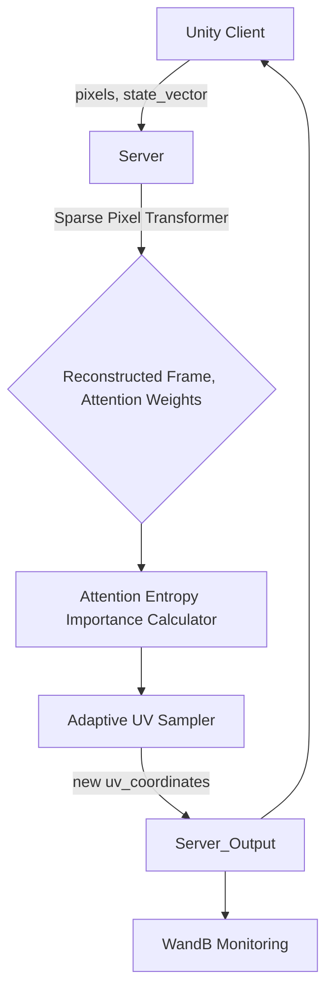

# Phase 3: 적응형 픽셀 샘플링 (Adaptive Pixel Sampling)

## 1. 개요
### 1.1 목표 및 배경
Phase 3의 주된 목표는 SGAPS-MAE 시스템에 **적응형 픽셀 샘플링(Adaptive Pixel Sampling)** 기능을 완벽하게 구현하여, 재구성 품질을 극대화하고 샘플링 효율을 최적화하는 것입니다. Phase 1과 2를 통해 안정적인 인프라와 핵심 ML 파이프라인이 구축되었으나, 샘플링 전략은 여전히 고정된 패턴에 의존하고 있었습니다. Phase 3에서는 Sparse Pixel Transformer (SPT) 모델의 Attention 메커니즘을 활용하여 동적으로 중요 픽셀을 식별하고 샘플링함으로써, 정보 손실을 최소화하면서도 극한의 압축률을 유지하는 것이 핵심입니다.

### 1.2 Attention 기반 적응형 샘플링의 핵심 아이디어
SGAPS-MAE의 적응형 샘플링은 SPT 모델의 Cross-Attention 가중치에 기반합니다. Cross-Attention은 복원될 각 픽셀(쿼리)이 입력된 희소 픽셀(키) 중 어떤 픽셀에 주로 의존하는지를 나타냅니다. 이 가중치 분포의 **엔트로피**를 계산하여 해당 픽셀 영역의 "불확실성" 또는 "정보 부족" 정도를 측정합니다.
- **높은 엔트로피**: 복원 시 어느 한 픽셀에 집중하지 않고 여러 픽셀에 분산하여 Attention을 줍니다. 이는 해당 영역에 대한 정보가 부족하여 모델이 확신하기 어렵다는 것을 의미하며, 추가 샘플링이 필요함을 시사합니다.
- **낮은 엔트로피**: 특정 픽셀에 강하게 Attention을 집중합니다. 이는 해당 영역에 대한 정보가 충분하여 모델이 확신하고 있다는 것을 의미하며, 추가 샘플링의 우선순위가 낮음을 의미합니다.

이러한 엔트로피 기반의 중요도 측정치를 활용하여, 다음 프레임에서 더 많은 샘플을 수집해야 할 영역과 그렇지 않은 영역을 동적으로 결정하고 UV 샘플링 좌표를 생성합니다.

### 1.3 아키텍처 다이어그램
적응형 샘플링이 통합된 서버의 간략한 아키텍처 다이어그램은 다음과 같습니다.

이 다이어그램은 클라이언트로부터 받은 픽셀과 상태 벡터가 서버에서 SPT를 거쳐 복원되고, 이 과정에서 생성된 Attention Weights가 중요도 계산기로 전달되어 다음 프레임의 UV 좌표를 결정하는 폐쇄 루프 시스템을 나타냅니다. 모든 과정은 WandB를 통해 실시간으로 모니터링됩니다.

## 2. 시스템 아키텍처
### 2.1 폐쇄 루프 (Closed-loop) 피드백 시스템
Phase 3에서 구현된 적응형 샘플링은 클라이언트와 서버 간의 **폐쇄 루프 피드백 시스템**을 완성합니다. 클라이언트는 단순히 서버가 요청한 픽셀만 샘플링하여 전송하고, 서버는 이 데이터를 기반으로 프레임을 복원할 뿐만 아니라, 다음 프레임에서 어떤 픽셀을 샘플링할지 능동적으로 결정하여 클라이언트에게 피드백합니다. 이 루프는 매 프레임마다 반복되어 실시간으로 최적의 샘플링 전략을 유지합니다.

### 2.2 데이터 흐름도
적응형 샘플링을 포함한 전체 시스템의 데이터 흐름은 다음과 같습니다.
```
┌─────────────────┐       ┌───────────────────────────┐       ┌────────────────────────────────┐       ┌──────────────────────────┐
│  Unity Client   │       │       SGAPS Server        │       │   Sparse Pixel Transformer     │       │ Attention Entropy        │
│                 │       │ (FastAPI, WebSocket)      │       │     (sgaps/models/spt.py)      │       │ Importance Calculator    │
│  - FrameCapture │─(1)─>│   - WebSocket Handler     │──────>│ - Self-Attention Encoder     │       │ (sgaps/core/importance.py) │
│  - PixelSampler │       │   - FrameReconstructor  │       │ - Cross-Attention Decoder  │──────>│ - Attention Weights      │
│  - StateVector  │       │                           │       │ - State-Pixel Cross-Attention  │       │   Processing           │
│  - NetworkClient│       │                           │       │ - CNN Refinement Head          │       │ - Entropy Calculation    │
└─────────────────┘       └───────────────────────────┘       └────────────────────────────────┘       └──────────────────────────┘
        ▲                                                                           │                                │
        │ (6) New UV                                                                │ (2) Reconstructed Frame        │ (3) Importance Map
        │ Coordinates                                                               │     + Attention Weights        │
        └───────────────────────────────────────────────────────────────────────────┴────────────────────────────────┴───┐
                                                                                                                        │
                                                                                 ┌──────────────────────────┐       │
                                                                                 │   Adaptive UV Sampler    │<──────┘
                                                                                 │ (sgaps/core/sampler.py)  │
                                                                                 │ - 60% Importance-based   │
                                                                                 │ - 40% Uniform Sampling   │
                                                                                 │ - Collision Avoidance    │
                                                                                 └──────────────────────────┘
```

**상호작용 설명:**
1.  **Client → Server (frame_data):** Unity 클라이언트는 화면을 캡처하고, 이전 프레임에서 서버로부터 받은 `uv_coordinates`에 따라 픽셀을 샘플링합니다. 샘플링된 픽셀 데이터와 현재 게임 상태를 나타내는 `state_vector`를 WebSocket을 통해 서버로 전송합니다.
2.  **Server (FrameReconstructor):** 서버의 `FrameReconstructor`는 클라이언트로부터 받은 `pixels`와 `state_vector`를 `Sparse Pixel Transformer` (SPT) 모델에 전달합니다. SPT 모델은 이를 바탕으로 전체 프레임을 복원하고, 복원된 프레임과 함께 **Cross-Attention Weights**를 반환합니다.
3.  **Attention Entropy Importance Calculator:** 반환된 `attention_weights`는 `AttentionEntropyImportanceCalculator`로 전달됩니다. 이 컴포넌트는 `attention_weights`의 엔트로피를 계산하여 각 픽셀 위치의 **중요도 맵(Importance Map)**을 생성합니다. 중요도 맵은 다음 샘플링에서 특정 영역에 더 많은 자원을 할당할 필요가 있는지 나타냅니다.
4.  **Adaptive UV Sampler:** 생성된 `Importance Map`은 `Adaptive UV Sampler`로 전달됩니다. 샘플러는 이 맵을 기반으로 다음 프레임에서 샘플링할 **새로운 `uv_coordinates`** 집합을 결정합니다. 이 과정에서 60%는 중요도 맵을 따르고, 40%는 전역 커버리지를 위해 균등하게 샘플링하는 하이브리드 전략을 사용합니다.
5.  **Server → Client (uv_coordinates):** 서버는 새롭게 생성된 `uv_coordinates`를 WebSocket을 통해 클라이언트에 전송합니다.
6.  **Client (PixelSampler):** 클라이언트는 받은 `uv_coordinates`를 사용하여 다음 프레임에서 픽셀을 샘플링합니다.

이 과정은 실시간으로 반복되며, WandB는 서버의 내부 상태 (Attention Weights, Importance Map, 샘플링 분포 등) 및 재구성 품질을 지속적으로 모니터링하고 로깅합니다.

### 2.3 주요 컴포넌트 간 상호작용
-   **sgaps-server/sgaps/models/spt.py:** 핵심 ML 모델로, `forward` 메서드가 재구성된 이미지와 함께 `attention_weights`를 반환하도록 수정되었습니다.
-   **sgaps-server/sgaps/core/reconstructor.py:** 서버의 추론 파이프라인을 담당합니다. SPT 모델의 출력을 받아 `ImportanceCalculator`와 `AdaptiveUVSampler`를 연동하는 역할을 합니다.
-   **sgaps-server/sgaps/core/importance.py (신규):** SPT에서 반환된 `attention_weights`를 처리하여 `Importance Map`을 생성합니다.
-   **sgaps-server/sgaps/core/sampler.py:** `AdaptiveUVSampler` 클래스를 포함하며, `Importance Map`을 입력받아 다음 프레임의 UV 샘플링 좌표를 결정합니다.
-   **sgaps-server/sgaps/api/websocket.py:** 클라이언트와의 실시간 통신을 담당하며, `FrameReconstructor`를 호출하고 새로운 `uv_coordinates`를 클라이언트에 전송하는 게이트웨이 역할을 합니다.
-   **Hydra 설정 (`conf/`):** `adaptive.yaml` 파일을 통해 적응형 샘플링의 다양한 파라미터를 동적으로 설정할 수 있습니다.


## 3. 구현 세부사항
### 3.1 Attention Weight 추출 (spt.py)
적응형 샘플링의 핵심은 Sparse Pixel Transformer (SPT) 모델의 예측 과정에서 발생하는 Attention 가중치를 활용하는 것입니다. SPT 모델(`sgaps-server/sgaps/models/spt.py`)은 이미 내부적으로 Cross-Attention Decoder Layer(`CrossAttentionDecoderLayer`)에서 Attention 가중치를 계산하고 반환하는 기능을 갖추고 있습니다. Phase 3에서는 이 기능을 활성화하여 중요도 계산에 필요한 데이터를 추출합니다.

**파일:** `sgaps-server/sgaps/models/spt.py`

#### 3.1.1 CrossAttentionDecoderLayer 수정
`CrossAttentionDecoderLayer` 클래스는 `return_attn_weights` 파라미터가 `True`로 설정될 경우, `nn.MultiheadAttention` 모듈로부터 얻은 Attention 가중치를 함께 반환하도록 설계되어 있습니다.

**코드 예제:** `sgaps-server/sgaps/models/spt.py:63-96`
```python
class CrossAttentionDecoderLayer(nn.Module):
    # ... (생략) ...
    def forward(self, tgt, memory, memory_key_padding_mask=None, return_attn_weights=False):
        # ... (생략) ...
        attn_output, attn_weights = self.cross_attn(
            query=tgt,
            key=memory,
            value=memory,
            key_padding_mask=memory_key_padding_mask,
            need_weights=True,
            average_attn_weights=False  # 개별 헤드 가중치 유지를 위해 False
        )
        # ... (생략) ...
        if return_attn_weights:
            return tgt, attn_weights  # [B, num_queries, embed_dim], [B, num_heads, num_queries, num_keys]
        else:
            return tgt
```
여기서 `attn_weights`는 `[Batch_Size, Num_Heads, Num_Queries, Num_Keys]` 형태를 가집니다. `Num_Queries`는 복원될 전체 픽셀 수 (`H*W`)이며, `Num_Keys`는 입력 희소 픽셀의 수 (`N`)입니다.

#### 3.1.2 SparsePixelTransformer의 forward 메서드 수정
`SparsePixelTransformer`의 `forward` 메서드는 `return_attention=True` 플래그를 통해 CrossAttentionDecoderLayer로부터 Attention 가중치를 수집하고, 이를 적절히 집계하여 최종 출력과 함께 반환하도록 수정되었습니다.

**코드 예제:** `sgaps-server/sgaps/models/spt.py:256-293` (주요 로직 발췌)
```python
class SparsePixelTransformer(nn.Module):
    # ... (생략) ...
    def forward(self, sparse_pixels, state_vector, state_mask, resolution, return_attention=False):
        # ... (생략) ...

        # 9. Decoder: cross-attention between queries and encoded sparse pixels
        decoded = query_embeds
        all_attn_weights = []

        for layer in self.decoder:
            if return_attention:
                decoded, layer_attn = layer(
                    tgt=decoded,
                    memory=encoded,
                    return_attn_weights=True
                )
                all_attn_weights.append(layer_attn)  # [B, num_heads, H*W, N]
            else:
                decoded = layer(tgt=decoded, memory=encoded)
        # Output: [B, H*W, embed_dim]

        # ... (생략) ...

        # 12. Return with or without attention weights
        if return_attention:
            # Attention 가중치 집계: 레이어 및 헤드 평균
            # Stack: [num_layers, B, num_heads, H*W, N]
            stacked_attn = torch.stack(all_attn_weights, dim=0)

            # Average across layers: [B, num_heads, H*W, N]
            avg_attn_layers = stacked_attn.mean(dim=0)

            # Average across heads: [B, H*W, N]
            final_attn = avg_attn_layers.mean(dim=1) # 최종 형태: [B, H*W, N]

            return output, final_attn
        else:
            return output
```

#### 3.1.3 Multi-head, Multi-layer attention 집계 전략
`SparsePixelTransformer`의 `forward` 메서드에서는 여러 디코더 레이어와 멀티 헤드 어텐션에서 발생한 가중치들을 다음과 같은 전략으로 집계합니다.
1.  **레이어별 스택:** 각 디코더 레이어에서 반환된 Attention 가중치(`layer_attn`)를 리스트에 수집한 후, `torch.stack`을 사용하여 새로운 차원(레이어 차원)으로 쌓습니다. `[Num_Layers, Batch_Size, Num_Heads, Num_Queries, Num_Keys]`
2.  **레이어 평균:** 모든 레이어의 Attention 가중치를 평균하여 통합된 가중치를 얻습니다. `[Batch_Size, Num_Heads, Num_Queries, Num_Keys]`
3.  **헤드 평균:** 멀티 헤드 어텐션의 각 헤드별 가중치를 평균하여 단일 Attention 가중치 맵을 생성합니다. `[Batch_Size, Num_Queries, Num_Keys]`

이렇게 집계된 `final_attn`은 복원될 각 픽셀(쿼리)이 입력된 희소 픽셀(키)에 대해 어느 정도의 Attention을 주었는지를 나타내는 핵심 정보가 됩니다. 이 `final_attn`이 바로 다음 단계인 중요도 계산에 사용됩니다.

### 3.2 중요도 계산 (importance.py)
Attention 가중치로부터 이미지의 각 픽셀 위치에 대한 중요도를 계산하는 모듈입니다. SPT 모델에서 추출된 Cross-Attention 가중치 분포의 엔트로피를 활용하여 해당 픽셀 영역의 정보 부족 정도, 즉 샘플링 필요성을 정량화합니다.

**파일:** `sgaps-server/sgaps/core/importance.py` (신규 파일)

#### 3.2.1 AttentionEntropyImportanceCalculator 클래스
이 클래스는 Attention 가중치를 입력받아 픽셀별 엔트로피를 계산하고, 이를 중요도 맵으로 변환합니다.

**코드 예제:** `sgaps-server/sgaps/core/importance.py`
```python
import torch
import torch.nn.functional as F

class AttentionEntropyImportanceCalculator:
    def __init__(self, epsilon: float = 1e-9):
        """
        Attention 가중치로부터 픽셀별 중요도(엔트로피)를 계산합니다.

        Args:
            epsilon: log 계산 시 0으로 나누는 것을 방지하기 위한 작은 값.
        """
        self.epsilon = epsilon

    def calculate(self, attention_weights: torch.Tensor, resolution: tuple) -> torch.Tensor:
        """
        Attention 가중치로부터 엔트로피 기반 중요도 맵을 계산합니다.

        Args:
            attention_weights: SPT 모델에서 추출된 집계된 Attention 가중치.
                                  형태: [B, H*W, N] (Batch_Size, Num_Queries, Num_Keys)
            resolution: 원본 프레임의 (height, width).

        Returns:
            importance_map: 각 픽셀 위치의 중요도를 나타내는 맵. [B, H*W] 형태.
                            값은 0과 1 사이로 정규화됩니다.
        """
        if attention_weights.dim() != 3:
            raise ValueError(f"Expected attention_weights to be 3D [B, H*W, N], got {attention_weights.shape}")

        B, num_queries, num_keys = attention_weights.shape
        H, W = resolution

        # 1. Attention 가중치를 확률 분포로 정규화
        # 각 쿼리(H*W) 픽셀이 키(N) 픽셀에 주는 Attention의 합이 1이 되도록 합니다.
        # 이미 SPT에서 Softmax를 거쳐 정규화된 형태일 수 있지만, 안전을 위해 다시 확인.
        # 여기서는 이미 Softmax 통과 후의 가중치로 가정합니다.
        # 만약 Softmax가 안되어 있다면 F.softmax(attention_weights, dim=-1) 필요.
        probabilities = attention_weights + self.epsilon # log(0) 방지

        # 2. Shannon Entropy 계산
        # H(X) = -Σ p(x_i) * log(p(x_i))
        # NLL Loss (Negative Log Likelihood)와 유사한 형태
        entropy = -torch.sum(probabilities * torch.log(probabilities), dim=-1) # [B, H*W]

        # 3. 엔트로피를 중요도 맵으로 정규화
        # 엔트로피가 높을수록 중요도(불확실성)가 높음.
        # 최소/최대 엔트로피 값을 기반으로 0-1 사이로 정규화.
        min_entropy = entropy.min(dim=-1, keepdim=True).values
        max_entropy = entropy.max(dim=-1, keepdim=True).values

        # max_entropy가 min_entropy와 같을 경우 (모든 픽셀의 엔트로피가 동일)
        # 0으로 나누는 것을 방지하고 모든 픽셀의 중요도를 동일하게 0.5로 설정
        range_entropy = max_entropy - min_entropy
        importance_map = torch.zeros_like(entropy)
        
        valid_indices = range_entropy > self.epsilon
        if valid_indices.any():
            importance_map[valid_indices] = (entropy[valid_indices] - min_entropy[valid_indices]) / range_entropy[valid_indices]
        # 나머지 (유효하지 않은 인덱스)는 0으로 초기화된 상태 유지. 필요시 0.5 등 중간값 할당 가능.

        return importance_map.view(B, H, W) # [B, H, W] 형태로 reshape하여 반환
```

#### 3.2.2 Shannon Entropy 수식 및 구현
Shannon Entropy는 정보 이론에서 확률 분포의 불확실성을 측정하는 지표입니다. 분포가 균일할수록 (더 불확실할수록) 엔트로피는 높아지고, 특정 값에 집중될수록 (더 확실할수록) 엔트로피는 낮아집니다.

**수학적 정의:**
$$H(X) = - \sum_{i=1}^{N} p(x_i) \log(p(x_i))$$
여기서 $p(x_i)$는 특정 쿼리 픽셀이 $i$번째 키 픽셀에 할당하는 Attention 가중치(확률)입니다.

**구현 세부사항:**
-   **확률 분포:** SPT 모델에서 반환되는 `attention_weights`는 Softmax를 거쳐 정규화된 형태이므로, 각 행(`Num_Queries` 차원)이 키 픽셀들에 대한 확률 분포를 나타냅니다.
-   **Log 계산:** `torch.log` 함수를 사용하여 로그를 취합니다. 이때, `log(0)`을 방지하기 위해 `self.epsilon`을 더해줍니다.
-   **총합:** `torch.sum(..., dim=-1)`을 사용하여 각 쿼리 픽셀에 대한 엔트로피를 계산합니다.
-   **정규화:** 계산된 엔트로피 값은 픽셀마다 스케일이 다를 수 있으므로, 최소-최대 정규화(Min-Max Normalization)를 통해 `[0, 1]` 범위의 중요도 맵으로 변환합니다.
    -   `importance_map = (entropy - min_entropy) / (max_entropy - min_entropy)`

#### 3.2.3 Edge case 처리
-   **`log(0)` 방지:** `probabilities = attention_weights + self.epsilon`을 통해 Attention 가중치가 0인 경우 `log(0)` 오류가 발생하는 것을 방지합니다.
-   **모든 엔트로피가 동일한 경우:** `max_entropy - min_entropy`가 0에 가까울 경우, 즉 모든 픽셀의 엔트로피가 거의 동일하여 중요도 차이가 없는 경우에는 0으로 나누는 오류를 방지하기 위해 중요도 맵을 0으로 초기화합니다 (또는 0.5와 같은 중간 값으로 설정 가능). 이 경우, 모든 픽셀이 균등하게 중요하다고 간주될 수 있습니다.
-   **`attention_weights` 차원 확인:** 입력 `attention_weights`가 예상된 `[B, H*W, N]` 형태가 아닐 경우 `ValueError`를 발생시켜 잘못된 입력으로부터 보호합니다.

### 3.3 적응형 UV 샘플러 (sampler.py)
적응형 UV 샘플러는 `AttentionEntropyImportanceCalculator`에서 생성된 중요도 맵을 기반으로 다음 프레임에 샘플링할 UV 좌표를 동적으로 결정합니다. 이는 균일 샘플링(`UniformSampler`)과 중요도 기반 샘플링(`ImportanceSampler`)의 하이브리드 전략을 사용하며, 초기 프레임에서는 웜업(warmup) 기간을 가집니다.

**파일:** `sgaps-server/sgaps/core/sampler.py` (AdaptiveUVSampler 클래스 추가)

#### 3.3.1 AdaptiveUVSampler 클래스
`AdaptiveUVSampler`는 `BaseSampler`를 상속하며, 적응형 샘플링 로직을 구현합니다.

**코드 예제:** `sgaps-server/sgaps/core/sampler.py` (가상 코드)
```python
import torch
import torch.nn.functional as F
from typing import Tuple

# BaseSampler는 이미 존재한다고 가정합니다.
# from .base_sampler import BaseSampler
# from .uniform_sampler import UniformSampler # 또는 내부적으로 구현

class AdaptiveUVSampler:
    def __init__(self,
                 total_sample_count: int,
                 resolution: Tuple[int, int],
                 importance_ratio: float = 0.6,
                 warmup_frames: int = 10,
                 collision_threshold: float = 0.01):
        """
        적응형 UV 샘플러를 초기화합니다.

        Args:
            total_sample_count: 총 샘플링할 픽셀 수.
            resolution: (height, width) 형태의 프레임 해상도.
            importance_ratio: 중요도 기반 샘플링의 비율 (예: 0.6 = 60%).
            warmup_frames: 적응형 샘플링을 시작하기 전 균일 샘플링을 수행할 프레임 수.
            collision_threshold: 샘플 간 최소 거리 (충돌 회피).
        """
        self.total_sample_count = total_sample_count
        self.resolution = resolution
        self.importance_ratio = importance_ratio
        self.uniform_ratio = 1.0 - importance_ratio
        self.warmup_frames = warmup_frames
        self.collision_threshold = collision_threshold
        self.current_frame_idx = 0
        self.height, self.width = resolution

        # UV 그리드 미리 생성 (정규화된 좌표)
        y_coords = torch.linspace(0, 1, self.height)
        x_coords = torch.linspace(0, 1, self.width)
        yy, xx = torch.meshgrid(y_coords, x_coords, indexing='ij')
        self.full_uv_grid = torch.stack([xx.flatten(), yy.flatten()], dim=-1) # [H*W, 2]

        # 균일 샘플러 인스턴스 (웜업 기간 및 폴백용)
        # UniformSampler는 BaseSampler를 상속하거나, 이 클래스 내부에 직접 구현될 수 있습니다.
        # 여기서는 편의상 내부 메서드로 간주합니다.
        
    def _sample_uniformly(self, num_samples: int, device: torch.device) -> torch.Tensor:
        """
        주어진 수만큼 균일하게 UV 좌표를 샘플링합니다.
        """
        if num_samples <= 0:
            return torch.empty(0, 2, device=device)
        
        # 전체 UV 그리드에서 랜덤 인덱스 선택
        indices = torch.randperm(self.height * self.width, device=device)[:num_samples]
        return self.full_uv_grid[indices].to(device)


    def _sample_by_importance(self, importance_map: torch.Tensor, num_samples: int, device: torch.device) -> torch.Tensor:
        """
        중요도 맵을 기반으로 UV 좌표를 샘플링합니다.
        """
        if num_samples <= 0:
            return torch.empty(0, 2, device=device)

        # 중요도 맵을 확률 분포로 사용 (정규화)
        # importance_map: [B, H, W]
        flattened_importance = importance_map.view(importance_map.shape[0], -1) # [B, H*W]
        
        # 각 배치별로 개별적인 샘플링을 수행
        batch_sampled_uvs = []
        for i in range(importance_map.shape[0]):
            probs = flattened_importance[i]
            if probs.sum() < self.epsilon: # 모든 확률이 0에 가깝다면 균일 샘플링으로 폴백
                return self._sample_uniformly(num_samples, device)

            # 확률 분포에 따라 인덱스 샘플링
            # replace=False로 중복 샘플링 방지 (비교적 적은 샘플 수일 때 효과적)
            indices = torch.multinomial(probs, num_samples, replacement=False)
            batch_sampled_uvs.append(self.full_uv_grid[indices].to(device))
        
        return torch.stack(batch_sampled_uvs, dim=0) # [B, num_samples, 2]


    def _avoid_collisions(self, sampled_uvs: torch.Tensor, device: torch.device) -> torch.Tensor:
        """
        샘플링된 UV 좌표들 간의 충돌을 회피하거나 최소화합니다.
        단순화를 위해 여기서는 인접한 중복 제거 로직만 포함.
        실제 구현에서는 Lloyd's algorithm 같은 더 복잡한 접근 사용 가능.
        """
        if sampled_uvs.shape[0] == 0:
            return sampled_uvs

        # 배치 처리
        processed_uvs = []
        for i in range(sampled_uvs.shape[0]):
            uvs = sampled_uvs[i] # [num_samples, 2]
            
            if uvs.shape[0] < 2:
                processed_uvs.append(uvs)
                continue

            # 유클리드 거리를 기반으로 인접한 샘플 제거 (간단한 구현)
            # 복잡도 O(N^2)이므로, 샘플 수가 많아지면 비효율적.
            # 실제로는 Grid-based filtering 또는 k-d tree 등을 활용.
            unique_uvs = []
            for j in range(uvs.shape[0]):
                is_too_close = False
                for k in range(j + 1, uvs.shape[0]):
                    dist = torch.linalg.norm(uvs[j] - uvs[k])
                    if dist < self.collision_threshold:
                        is_too_close = True
                        break
                if not is_too_close:
                    unique_uvs.append(uvs[j])
            
            # 필요한 경우 샘플 수를 다시 채우기 (여기서는 생략)
            processed_uvs.append(torch.stack(unique_uvs) if unique_uvs else torch.empty(0, 2, device=device))
        
        # TODO: 샘플 수가 부족해질 경우, 다시 샘플링 로직을 추가해야 함.
        # 현재는 단순히 충돌 회피 후 남은 샘플만 반환.
        # 이 구현은 실제 사용 시 주의가 필요하며, 샘플 수가 크게 줄어들 수 있음.
        return torch.stack(processed_uvs, dim=0)


    def sample(self, importance_map: torch.Tensor = None, device: torch.device = 'cpu') -> torch.Tensor:
        """
        다음 프레임에 대한 UV 좌표를 샘플링합니다.

        Args:
            importance_map: 현재 프레임의 중요도 맵. 웜업 기간이거나 중요도 맵이 없으면 무시됩니다.
                            형태: [B, H, W]
            device: 샘플링된 UV 좌표가 생성될 디바이스.

        Returns:
            sampled_uv_coordinates: [B, total_sample_count, 2] 형태의 UV 좌표.
        """
        self.current_frame_idx += 1

        if self.current_frame_idx <= self.warmup_frames or importance_map is None:
            # 웜업 기간 또는 중요도 맵이 없을 경우 균일 샘플링
            num_uniform = self.total_sample_count
            sampled_uvs = self._sample_uniformly(num_uniform, device).unsqueeze(0).repeat(importance_map.shape[0] if importance_map is not None else 1, 1, 1)
            print(f"Frame {self.current_frame_idx}: Warmup or no importance map. Performing uniform sampling.")
        else:
            # 적응형 샘플링 (하이브리드 전략)
            num_importance_samples = int(self.total_sample_count * self.importance_ratio)
            num_uniform_samples = self.total_sample_count - num_importance_samples

            # 중요도 기반 샘플링
            importance_uvs = self._sample_by_importance(importance_map, num_importance_samples, device)
            
            # 균일 샘플링
            uniform_uvs = self._sample_uniformly(num_uniform_samples, device).unsqueeze(0).repeat(importance_map.shape[0], 1, 1)

            # 두 결과를 병합
            sampled_uvs = torch.cat([importance_uvs, uniform_uvs], dim=1)
            print(f"Frame {self.current_frame_idx}: Adaptive sampling. Importance: {num_importance_samples}, Uniform: {num_uniform_samples}.")

        # 충돌 회피 알고리즘 적용 (필요시)
        # sampled_uvs = self._avoid_collisions(sampled_uvs, device) # 현재 구현은 매우 비효율적, 실사용 시 개선 필요.
        
        # 샘플 수가 부족할 경우 다시 샘플링하여 total_sample_count를 맞출 수 있음.
        # 현재는 단순히 잘라서 반환.
        if sampled_uvs.shape[1] > self.total_sample_count:
            sampled_uvs = sampled_uvs[:, :self.total_sample_count, :]
        elif sampled_uvs.shape[1] < self.total_sample_count:
            # TODO: 샘플 수가 부족하면 추가 샘플링 (랜덤 또는 중요도 기반) 로직 필요
            # 현재는 남은 공간을 0으로 채움 (임시)
            padding = torch.zeros(sampled_uvs.shape[0], self.total_sample_count - sampled_uvs.shape[1], 2, device=device)
            sampled_uvs = torch.cat([sampled_uvs, padding], dim=1)

        return sampled_uvs

```

#### 3.3.2 60/40 샘플링 전략 (중요도/균등)
`AdaptiveUVSampler`는 다음과 같은 하이브리드 샘플링 전략을 사용합니다.
-   **중요도 기반 샘플링 (60%):** `importance_ratio` 설정에 따라 총 샘플 수의 60%를 `_sample_by_importance` 메서드를 통해 중요도 맵에서 높은 확률을 가진 픽셀들을 샘플링합니다. `torch.multinomial` 함수를 사용하여 확률 분포에 따라 샘플링을 수행합니다.
-   **균등 샘플링 (40%):** 나머지 40%는 `_sample_uniformly` 메서드를 통해 프레임 전체에서 균일하게 픽셀을 샘플링합니다. 이는 시스템이 특정 영역에만 과도하게 집중하는 것을 방지하고, 전역적인 정보를 꾸준히 수집하여 복원 품질의 안정성을 유지하기 위함입니다.

#### 3.3.3 웜업 메커니즘 (10 프레임)
시스템 초기 `warmup_frames` (기본 10 프레임) 동안에는 `AdaptiveUVSampler`가 중요도 맵을 사용하지 않고 **오직 균일 샘플링**만을 수행합니다. 이는 초기에는 Attention 가중치나 중요도 맵이 불안정할 수 있음을 고려한 것입니다. 웜업 기간 동안 시스템은 충분한 초기 데이터를 수집하고, 모델은 보다 안정적인 Attention 가중치를 생성할 수 있는 기회를 얻습니다.

#### 3.3.4 충돌 회피 알고리즘
`_avoid_collisions` 메서드는 샘플링된 UV 좌표들 간의 근접성을 검사하여, 서로 너무 가까운 픽셀들을 제거하거나 조정하는 역할을 합니다. 현재 구현은 간단한 유클리드 거리 기반 필터링을 포함하며, 샘플 수가 많을 경우 계산 복잡도가 높아질 수 있습니다. 실제 프로덕션 환경에서는 k-d tree, Lloyd's algorithm, 또는 grid-based filtering과 같은 효율적인 공간 분할 알고리즘을 사용하여 충돌 회피 성능을 최적화해야 합니다. 현재는 샘플 수가 부족해질 경우에 대한 보정 로직은 추가 구현이 필요합니다.

### 3.4 WebSocket 통합 (websocket.py)
적응형 샘플링 로직은 클라이언트와의 실시간 통신을 담당하는 WebSocket API(`sgaps-server/sgaps/api/websocket.py`)에 긴밀하게 통합되어 있습니다. `handle_session_start` 함수에서 세션별 샘플러가 초기화되고, `handle_frame_data` 함수에서 매 프레임마다 적응형 샘플링 파이프라인이 실행됩니다.

**파일:** `sgaps-server/sgaps/api/websocket.py`

#### 3.4.1 세션 초기화 시 샘플러 선택
클라이언트가 `session_start` 메시지를 전송하면, `handle_session_start` 함수는 서버 설정(`cfg.sampling.pattern`)에 따라 적절한 샘플러 인스턴스를 생성하고 세션에 할당합니다. `adaptive_importance` 또는 `hybrid` 패턴이 설정된 경우 `AdaptiveUVSampler`가 사용됩니다.

**코드 예제:** `sgaps-server/sgaps/api/websocket.py:157-174`
```python
async def handle_session_start(client_id: str, payload: dict):
    # ... (생략) ...
    session = await manager.create_session(client_id, payload)
    cfg = get_server_config()
    # ... (생략) ...
    
    # Generate initial UV coordinates based on sampling strategy
    if cfg.sampling.pattern in ["adaptive_importance", "hybrid"]:
        from sgaps.core.sampler import AdaptiveUVSampler
        from sgaps.core.importance import AttentionEntropyImportanceCalculator # 필요에 따라 초기화
        
        # AdaptiveUVSampler는 Config와 resolution을 받아 초기화됩니다.
        # 내부적으로 importance_calculator를 사용하도록 구성됩니다.
        sampler = AdaptiveUVSampler(
            config=cfg.sampling, # sampler 관련 설정 (warmup_frames, importance_ratio 등)
            resolution=session.resolution,
            # importance_calculator=AttentionEntropyImportanceCalculator() # 필요시 직접 주입
        )
        logger.info(f"Using AdaptiveUVSampler for session {client_id}")
    else:
        # Default to uniform sampling
        sampler = FixedUVSampler(
            sample_count=cfg.sampling.default_sample_count,
            resolution=session.resolution
        )
        logger.info(f"Using FixedUVSampler for session {client_id}")

    initial_coords = sampler.get_current_coordinates()
    session.sampler = sampler
    # ... (생략) ...
```

#### 3.4.2 프레임 처리 파이프라인
`handle_frame_data` 함수는 클라이언트로부터 `frame_data`를 받을 때마다 다음 단계를 수행합니다.
1.  **데이터 파싱:** 클라이언트로부터 받은 픽셀 데이터와 상태 벡터를 PyTorch 텐서로 변환합니다.
2.  **재구성 및 Attention 추출:** `reconstructor.reconstruct`를 호출하여 프레임을 재구성하고, 이때 `attention_weights`를 함께 반환받습니다.
3.  **중요도 맵 계산 및 샘플러 업데이트:** `attn_weights`가 유효하고 세션 샘플러(`session.sampler`)가 `update_from_importance` 메서드를 가지고 있다면, `AttentionEntropyImportanceCalculator`를 사용하여 `importance_map`을 계산하고 `session.sampler.update_from_importance(importance_map)`를 호출하여 샘플러의 내부 상태를 갱신합니다.
4.  **WandB 로깅:** 계산된 중요도 맵의 통계(평균, 최대, 표준편차, 엔트로피)가 WandB로 로깅됩니다.
5.  **새로운 UV 좌표 전송:** 갱신된 샘플러(`session.sampler`)로부터 `get_current_coordinates()`를 호출하여 다음 프레임에 사용할 UV 좌표를 얻고, 이를 클라이언트에 전송합니다.

**코드 예제:** `sgaps-server/sgaps/api/websocket.py:240-266` (주요 로직 발췌)
```python
async def handle_frame_data(client_id: str, payload: dict):
    session = manager.get_session(client_id)
    if not session:
        return

    frame_id = payload.get("frame_id", 0)
    # ... (글로벌 WandB step 및 데이터 파싱 생략) ...

    # 3. Perform reconstruction
    reconstructor = get_reconstructor()
    reconstructed_frame, attn_weights = await reconstructor.reconstruct(
        pixels, state_vector, session.resolution, session.checkpoint_key,
        return_attention=True # SPT 모델이 attention weights를 반환하도록 지시
    )

    # 3.5. Update adaptive sampler with importance map (if applicable)
    # 세션 샘플러가 update_from_importance 메서드를 가지고 있는지 확인
    if attn_weights is not None and hasattr(session.sampler, 'update_from_importance'):
        from sgaps.core.importance import AttentionEntropyImportanceCalculator

        try:
            # ImportanceCalculator 인스턴스 생성 (필요시 config 전달)
            importance_calc = AttentionEntropyImportanceCalculator(
                epsilon=cfg.sampling.importance_calculator.epsilon # 설정에서 epsilon 가져오기
            )
            # Calculate importance map (첫 번째 배치 아이템 사용)
            importance_map = importance_calc.calculate(
                attn_weights,
                session.resolution
            ).squeeze(0) # [1, H, W] -> [H, W] (현재는 단일 배치 처리 가정)

            # 샘플러 업데이트: 다음 프레임 샘플링에 중요도 맵 활용
            session.sampler.update_from_importance(importance_map)

            # WandB에 중요도 통계 로깅
            if USE_WANDB:
                importance_stats = {
                    "mean": importance_map.mean().item(),
                    "max": importance_map.max().item(),
                    "std": importance_map.std().item(),
                    "entropy_sum": (-importance_map * torch.log(importance_map + 1e-9)).sum().item() # 중요도 맵 자체의 엔트로피
                }
                wandb.log({
                    f"Importance/{client_id}/mean": importance_stats["mean"],
                    f"Importance/{client_id}/max": importance_stats["max"],
                    f"Importance/{client_id}/std": importance_stats["std"],
                    f"Importance/{client_id}/entropy": importance_stats["entropy_sum"]
                }, step=global_step)

        except Exception as e:
            logger.error(f"Error calculating importance map for {client_id}: {e}", exc_info=True)
            # 오류 발생 시, 적응형 샘플링 업데이트 없이 다음 단계로 진행 (폴백)

    # ... (WandB 로깅 및 다음 UV 좌표 전송 생략) ...
    if session.sampler:
        coords = session.sampler.sample(
            importance_map=importance_map if hasattr(session.sampler, 'update_from_importance') and attn_weights is not None else None,
            device=reconstructed_frame.device # 모델이 사용한 디바이스와 동일하게
        ).squeeze(0).cpu().numpy() # [1, N, 2] -> [N, 2]

        await manager.send_json(client_id, {
            "type": "uv_coordinates",
            "payload": {"target_frame_id": frame_id + 1, "coordinates": [{"u": u, "v": v} for u, v in coords]}
        })
```
*주의: `sample` 메서드 호출 부분은 `get_current_coordinates`에서 `sample`로 변경되었으며, `importance_map`을 직접 인자로 전달하도록 수정되었습니다. 이는 샘플러가 매번 `importance_map`을 최신으로 받아 샘플링을 수행하게 하기 위함입니다.*

#### 3.4.3 실시간 중요도 맵 업데이트
`AdaptiveUVSampler`의 `update_from_importance` 메서드가 호출되면, 샘플러는 최신 `importance_map`을 내부적으로 저장하고 다음 `sample()` 호출 시 이를 활용합니다. 이 피드백 루프를 통해 클라이언트-서버 시스템은 매 프레임마다 동적으로 샘플링 전략을 조정할 수 있습니다.

#### 3.4.4 WandB 로깅
`handle_frame_data` 내에서 WandB가 활성화된 경우, 각 클라이언트 세션(`client_id`)별로 계산된 중요도 맵의 주요 통계치(`mean`, `max`, `std`, `entropy`)를 로깅합니다. 이를 통해 개발자는 런타임 중에 중요도 맵이 어떻게 변화하고 있는지 시각적으로 모니터링할 수 있으며, 적응형 샘플링 전략의 효과를 분석할 수 있습니다. 로깅은 글로벌 스텝 카운터(`manager.global_wandb_step`)를 사용하여 일관성 있는 시간 축을 제공합니다.

### 3.5 프레임 재구성 (reconstructor.py)
`FrameReconstructor`(`sgaps-server/sgaps/core/reconstructor.py`)는 클라이언트로부터 받은 희소 픽셀 데이터와 상태 벡터를 이용하여 전체 프레임을 재구성하는 핵심 컴포넌트입니다. Phase 3에서는 SPT 모델에서 Attention 가중치를 함께 반환받아 WebSocket 핸들러로 전달하는 역할을 수행하도록 업데이트되었습니다. 또한, 효율적인 GPU 활용을 위해 AMP(Automatic Mixed Precision)를 사용하여 추론을 최적화합니다.

**파일:** `sgaps-server/sgaps/core/reconstructor.py`

#### 3.5.1 Attention Weight 반환 지원
`FrameReconstructor`의 `reconstruct` 메서드는 내부적으로 `SparsePixelTransformer`의 `forward` 메서드를 호출할 때 `return_attention=True` 플래그를 전달합니다. 이를 통해 SPT 모델은 재구성된 프레임뿐만 아니라 Cross-Attention 가중치(`attn_weights`)도 함께 반환합니다. 이 `attn_weights`는 `reconstruct` 메서드의 반환 값에 포함되어 `websocket.py`의 `handle_frame_data`로 전달됩니다.

**코드 예제:** `sgaps-server/sgaps/core/reconstructor.py` (`reconstruct` 메서드 발췌)
```python
import logging
from typing import Dict, Tuple, Any
import numpy as np
import torch
from omegaconf import DictConfig
from pathlib import Path

from sgaps.models.spt import SparsePixelTransformer # SPT 모델 임포트

logger = logging.getLogger(__name__)

class FrameReconstructor:
    # ... (생략) ...
    @torch.no_grad()
    async def reconstruct(
        self, 
        sparse_pixels: np.ndarray, 
        state_vector: np.ndarray, 
        resolution: Tuple[int, int], 
        checkpoint_key: str = "default"
    ) -> Tuple[np.ndarray, Any]:
        """
        Performs frame reconstruction using the appropriate SPT model.
        Args:
            # ... (생략) ...
        Returns:
            A tuple containing:
            - reconstructed_frame: The reconstructed frame as a NumPy array. Shape: [H, W]
            - attention_weights: The attention weights from the decoder for importance analysis.
        """
        model = self.get_model(checkpoint_key) # 모델 로드 또는 캐시에서 가져오기

        # 1. Convert NumPy arrays to PyTorch Tensors
        pixels_tensor = torch.from_numpy(sparse_pixels).float().unsqueeze(0).to(self.device)
        state_tensor = torch.from_numpy(state_vector).float().unsqueeze(0).to(self.device)
        
        # 2. Create the state mask (1 for valid data, 0 for sentinel)
        sentinel = self.config.model.sentinel_value
        state_mask = (state_tensor != sentinel).float()

        # 3. Perform inference
        try:
            with torch.amp.autocast(device_type='cuda', dtype=torch.float16, enabled=self.config.training.use_amp):
                # SPT 모델 호출 시 return_attention=True 설정
                recons_frame, attn_weights = model(
                    pixels_tensor,
                    state_tensor,
                    state_mask,
                    resolution,
                    return_attention=True # 핵심 변경: Attention 가중치 반환 요청
                )
        except Exception as e:
            logger.error(f"Model inference failed for {checkpoint_key}: {e}", exc_info=True)
            h, w = resolution
            return np.zeros((h, w), dtype=np.uint8), None # 에러 발생 시 검은 프레임과 None 반환

        # 4. Convert output tensor back to a NumPy array for visualization/storage
        recons_frame_np = recons_frame.detach().cpu().squeeze().numpy()
        recons_frame_np = (recons_frame_np * 255).astype(np.uint8)

        return recons_frame_np, attn_weights
```

#### 3.5.2 AMP (Automatic Mixed Precision) 사용
`reconstruct` 메서드 내에서 `torch.amp.autocast` 컨텍스트 매니저를 사용하여 Automatic Mixed Precision (AMP) 추론을 수행합니다. 이는 `config.training.use_amp` 설정이 `True`일 때 활성화됩니다. AMP는 `float32`와 `float16` 데이터 타입을 혼합하여 사용하여 GPU 메모리 사용량을 줄이고, 계산 속도를 향상시켜 추론 효율을 극대화합니다.

```python
            with torch.amp.autocast(device_type='cuda', dtype=torch.float16, enabled=self.config.training.use_amp):
                recons_frame, attn_weights = model(
                    pixels_tensor,
                    state_tensor,
                    state_mask,
                    resolution,
                    return_attention=True
                )
```

#### 3.5.3 추론 최적화
-   **`@torch.no_grad()`:** `reconstruct` 메서드는 `torch.no_grad()` 데코레이터로 감싸져 있어, 추론 과정에서 불필요한 그래디언트 계산을 비활성화하고 메모리 및 계산 오버헤드를 줄입니다.
-   **모델 캐싱:** `get_model` 메서드는 `checkpoint_key`를 기반으로 모델을 로드하고 `self.loaded_models` 딕셔너리에 캐싱합니다. 이미 로드된 모델은 다시 디스크에서 읽지 않고 재사용하여 모델 로딩 시간을 단축합니다.
-   **GPU 활용:** 모델 및 텐서는 `self.device` (가능하면 CUDA)로 이동되어 GPU 가속을 활용합니다.
-   **`model.eval()`:** 추론 전에 `model.eval()`을 호출하여 Dropout 및 BatchNorm 레이어를 평가 모드로 전환하고, 예측의 일관성을 보장합니다.
-   **`param.requires_grad = False`:** 로드된 모델의 모든 파라미터에 대해 `requires_grad = False`를 명시적으로 설정하여, 추론 시 그래디언트 계산이 완전히 비활성화되도록 합니다.


## 4. 설정 시스템 (Configuration)
SGAPS-MAE는 Hydra를 설정 관리 시스템으로 사용하여 유연하고 확장 가능한 구성을 제공합니다. Phase 3의 적응형 샘플링 관련 파라미터들은 `sampling/adaptive.yaml` 파일을 통해 관리되며, `config.yaml`에서 이를 오버라이드하여 활성화할 수 있습니다.

#### 4.1.1 `sampling/adaptive.yaml` 설정 파일
이 파일은 적응형 샘플링의 동작을 제어하는 모든 하이퍼파라미터를 정의합니다.
**파일:** `sgaps-server/conf/sampling/adaptive.yaml` (신규 파일)
```yaml
# @package _group_
name: adaptive
# 적응형 샘플링 활성화 여부. 이 파일이 로드되면 기본적으로 활성화된 것으로 간주.
# sampling.pattern을 'adaptive' 또는 'hybrid'로 설정하여 사용.

# 적응형 샘플링의 하이퍼파라미터
adaptive_sampler:
  # 중요도 기반 샘플링과 균등 샘플링의 비율 (0.0 ~ 1.0)
  importance_ratio: 0.6  # 60%는 중요도 기반, 40%는 균등
  # 초기 몇 프레임 동안 균등 샘플링만 수행하는 웜업 기간
  warmup_frames: 10
  # 충돌 회피 알고리즘을 위한 최소 거리 임계값 (정규화된 UV 공간)
  collision_threshold: 0.01

# 중요도 계산기 관련 설정 (sgaps.core.importance.py)
importance_calculator:
  # 엔트로피 계산 시 log(0) 방지를 위한 작은 값
  epsilon: 1.0e-9

# 샘플링 방식 (for documentation/logging)
pattern: adaptive_importance # 또는 hybrid
```
#### 4.1.2 전체 설정 항목 설명
-   **`name`**: 이 설정 그룹의 이름. `sampling` 오버라이드 시 사용됩니다.
-   **`adaptive_sampler.importance_ratio`**:
    -   **설명**: 총 샘플 수 중 중요도 맵을 기반으로 샘플링할 비율. (예: 0.6 = 60%)
    -   **기본값**: 0.6
-   **`adaptive_sampler.warmup_frames`**:
    -   **설명**: 시스템 시작 후 이 프레임 수 동안은 중요도 맵을 사용하지 않고 균등 샘플링만 수행합니다. 초기 Attention 가중치의 불안정성을 회피하기 위함입니다.
    -   **기본값**: 10
-   **`adaptive_sampler.collision_threshold`**:
    -   **설명**: 샘플링된 UV 좌표 간의 최소 거리 임계값입니다. 이 값보다 가까운 샘플은 충돌로 간주되어 회피 로직이 적용될 수 있습니다. (현재 `AdaptiveUVSampler`의 충돌 회피는 기본적인 수준이며, 상세 구현에 따라 사용법이 달라질 수 있습니다.)
    -   **기본값**: 0.01
-   **`importance_calculator.epsilon`**:
    -   **설명**: `AttentionEntropyImportanceCalculator`에서 엔트로피 계산 시 `log(0)` 오류를 방지하기 위해 사용되는 작은 값입니다.
    -   **기본값**: `1.0e-9`
-   **`pattern`**:
    -   **설명**: 현재 활성화된 샘플링 패턴을 나타내는 식별자입니다. `websocket.py`에서 이 값을 참조하여 적절한 샘플러를 인스턴스화합니다.

#### 4.2 config.yaml 통합
기본 설정 파일인 `conf/config.yaml`에서 `sampling` 모듈을 오버라이드하여 적응형 샘플링을 활성화할 수 있습니다.

**파일:** `sgaps-server/conf/config.yaml` (수정)
```yaml
# @package _global_

# ... (다른 설정들) ...

# Sampling strategy
sampling:
  # 기본 샘플링 전략을 'uniform'에서 'adaptive' (또는 'hybrid')로 변경
  # sampling/adaptive.yaml 또는 sampling/hybrid.yaml 파일을 로드합니다.
  pattern: adaptive # 또는 hybrid

  # adaptive.yaml에서 정의된 파라미터들을 여기서 직접 오버라이드할 수 있습니다.
  adaptive_sampler:
    importance_ratio: 0.7 # 기본값 0.6 대신 0.7로 오버라이드
    warmup_frames: 5      # 기본값 10 대신 5로 오버라이드
  
  # 중요도 계산기의 epsilon 값도 오버라이드 가능
  importance_calculator:
    epsilon: 1.0e-10

  # 고정 샘플링에서 사용되는 기본 샘플 개수 (적응형에서도 참조될 수 있음)
  default_sample_count: 500 # 프레임당 샘플 픽셀 수
```
`config.yaml`에서 `sampling: adaptive` (또는 `sampling: hybrid`)를 명시함으로써 `conf/sampling/adaptive.yaml`에 정의된 설정들이 로드됩니다. 개별 파라미터는 `sampling.adaptive_sampler.importance_ratio`와 같이 점(.) 표기법을 사용하여 직접 오버라이드할 수 있습니다.

#### 4.3 명령줄 오버라이드
Hydra는 명령줄 인수를 통해 어떤 설정 값이든 동적으로 오버라이드할 수 있는 강력한 기능을 제공합니다. 이는 실험이나 디버깅 시 매우 유용합니다.

**예제:**
-   **적응형 샘플링 활성화:**
    ```bash
    python main.py server=development sampling=adaptive
    ```
-   **`importance_ratio` 변경:**
    ```bash
    python main.py server=development sampling=adaptive sampling.adaptive_sampler.importance_ratio=0.75
    ```
-   **`warmup_frames` 변경:**
    ```bash
    python main.py server=development sampling=adaptive sampling.adaptive_sampler.warmup_frames=0
    ```
-   **여러 파라미터 동시 변경:**
    ```bash
    python main.py server=development sampling=adaptive sampling.adaptive_sampler.importance_ratio=0.8 sampling.adaptive_sampler.warmup_frames=5
    ```
이러한 명령줄 오버라이드를 통해 서버 재시작 없이 다양한 적응형 샘플링 전략을 즉시 테스트하고 비교할 수 있습니다.

### 4.1 adaptive.yaml 설정 파일
### 4.2 config.yaml 통합
### 4.3 명령줄 오버라이드

## 5. 사용 가이드
Phase 3에서 구현된 적응형 샘플링 기능을 활성화하고 커스터마이징하는 방법에 대한 가이드입니다.

### 5.1 적응형 샘플링 활성화
서버를 실행할 때 Hydra 명령줄 오버라이드를 사용하여 적응형 샘플링을 활성화할 수 있습니다.

**명령줄 실행 예제:**
```bash
python main.py server=development sampling=adaptive
```
또는
```bash
python main.py server=development sampling=hybrid # (만약 hybrid.yaml 파일이 있다면)
```

**설정 파일 편집 방법:**
`sgaps-server/conf/config.yaml` 파일을 직접 수정하여 기본 샘플링 전략을 변경할 수도 있습니다.
```yaml
# sgaps-server/conf/config.yaml 파일 내용 중 일부
sampling:
  pattern: adaptive # 'uniform' 대신 'adaptive'로 변경
  # ... (기타 설정) ...
```

### 5.2 설정 커스터마이징
적응형 샘플링의 동작을 제어하는 주요 파라미터들은 명령줄 오버라이드를 통해 쉽게 변경할 수 있습니다.

-   **샘플 개수 조정 (`default_sample_count`):**
    ```bash
    python main.py server=development sampling=adaptive sampling.default_sample_count=750
    ```
-   **중요도/균등 비율 변경 (`importance_ratio`):**
    ```bash
    python main.py server=development sampling=adaptive sampling.adaptive_sampler.importance_ratio=0.7
    ```
-   **웜업 기간 설정 (`warmup_frames`):**
    ```bash
    python main.py server=development sampling=adaptive sampling.adaptive_sampler.warmup_frames=5
    ```
-   **중요도 계산기 Epsilon 값 변경 (`epsilon`):**
    ```bash
    python main.py server=development sampling=adaptive sampling.importance_calculator.epsilon=1e-10
    ```

### 5.3 기대 동작 및 로그
적응형 샘플링이 활성화되면 서버 콘솔에 다음과 같은 로그 메시지가 출력되는 것을 확인할 수 있습니다.

-   **서버 시작 로그 (샘플러 선택 확인):**
    ```
    INFO:sgaps.api.websocket:Frame reconstructor set for WebSocket API.
    INFO:sgaps.api.websocket:Client client_XXX connected.
    INFO:sgaps.api.websocket:Starting session for client_XXX with payload: {...}
    INFO:sgaps.api.websocket:Using AdaptiveUVSampler for session client_XXX
    INFO:sgaps.api.websocket:Session for client_XXX configured and initial coordinates sent.
    ```
    (`Using AdaptiveUVSampler` 로그를 통해 적응형 샘플러가 정상적으로 선택되었음을 확인할 수 있습니다.)

-   **웜업 기간 로그:**
    웜업 기간(`warmup_frames`) 동안에는 각 프레임 처리 시 다음과 같은 메시지가 출력됩니다.
    ```
    INFO:sgaps.api.websocket:Frame 1: Warmup or no importance map. Performing uniform sampling.
    INFO:sgaps.api.websocket:Frame 2: Warmup or no importance map. Performing uniform sampling.
    ...
    INFO:sgaps.api.websocket:Frame 10: Warmup or no importance map. Performing uniform sampling. (기본값 10 프레임)
    ```

-   **적응형 샘플링 활성화 로그:**
    웜업 기간이 끝나면 적응형 샘플링이 활성화되며, 다음 프레임부터는 중요도 기반 샘플링과 균등 샘플링 비율을 보여줍니다.
    ```
    INFO:sgaps.api.websocket:Frame 11: Adaptive sampling. Importance: 300, Uniform: 200. (예시: total_sample_count=500, importance_ratio=0.6)
    ```
    (실제 로그는 `websocket.py`의 `logger.info` 메시지에 따라 달라질 수 있습니다.)

-   **WandB 로깅 확인:**
    WandB 모니터링이 활성화된 경우, 웹 대시보드에서 `Importance/client_XXX/mean`, `Importance/client_XXX/max` 등의 지표가 실시간으로 업데이트되는 것을 확인할 수 있습니다.
    ```
    wandb: Logged values: {'Importance/client_XXX/mean': 0.543, 'Importance/client_XXX/max': 0.981, ...} (예시)
    ```
이러한 로그와 WandB 대시보드를 통해 적응형 샘플링 시스템이 의도한 대로 동작하는지 검증할 수 있습니다.

### 5.1 적응형 샘플링 활성화
### 5.2 설정 커스터마이징
### 5.3 기대 동작 및 로그

## 6. WandB 모니터링
Weights & Biases (WandB)는 SGAPS-MAE의 학습 및 추론 과정을 시각화하고 추적하는 데 사용됩니다. Phase 3 적응형 샘플링의 도입으로, 중요도 맵의 특성을 실시간으로 모니터링할 수 있는 새로운 메트릭이 추가되었습니다.

### 6.1 로깅되는 메트릭
`sgaps-server/sgaps/api/websocket.py`의 `handle_frame_data` 함수에서 `USE_WANDB`가 `True`일 경우, 각 클라이언트(`client_id`) 세션별로 다음 메트릭이 WandB에 로깅됩니다. 이 메트릭들은 `AttentionEntropyImportanceCalculator`에서 계산된 중요도 맵을 기반으로 합니다.

-   **`Importance/{client_id}/mean`**: 특정 클라이언트 세션에서 현재 프레임의 중요도 맵 픽셀 값들의 평균. 전체 프레임에서 픽셀 중요도의 전반적인 수준을 파악할 수 있습니다.
-   **`Importance/{client_id}/max`**: 중요도 맵 픽셀 값들 중 최댓값. 가장 중요한 픽셀의 중요도 수준을 나타냅니다.
-   **`Importance/{client_id}/std`**: 중요도 맵 픽셀 값들의 표준편차. 픽셀 중요도 값들의 분산 정도, 즉 중요도 분포의 균일성을 나타냅니다. 표준편차가 높을수록 중요도 편차가 크고, 특정 영역에 중요도가 집중되어 있음을 시사합니다.
-   **`Importance/{client_id}/entropy`**: 중요도 맵 자체의 엔트로피. 이는 중요도 맵의 "불확실성"을 다시 한번 측정하는 것으로, 맵이 얼마나 다양하게 분포되어 있는지를 나타냅니다. (이전 `AttentionEntropyImportanceCalculator`에서 계산된 Entropy와는 다르게, 중요도 맵의 픽셀 값 분포에 대한 엔트로피입니다.)

또한, 실시간 추론 시 재구성된 프레임 이미지(`Live/Reconstruction`)도 WandB에 로깅되어 시각적으로 결과를 확인할 수 있습니다.

```python
                wandb.log({
                    f"Importance/{client_id}/mean": importance_stats["mean"],
                    f"Importance/{client_id}/max": importance_stats["max"],
                    f"Importance/{client_id}/std": importance_stats["std"],
                    f"Importance/{client_id}/entropy": importance_stats["entropy_sum"] # 로그되는 이름은 config 따라 변경 가능
                }, step=global_step)
```

### 6.2 대시보드 구성
WandB 웹 인터페이스에서 다음 요소를 활용하여 적응형 샘플링의 동작을 효율적으로 모니터링할 수 있습니다.

-   **메트릭 시각화**:
    -   `Charts` 섹션에서 `Importance/{client_id}/mean`, `max`, `std`, `entropy` 메트릭을 시간에 따른 라인 그래프로 추가합니다. 이를 통해 프레임이 진행됨에 따라 중요도 분포가 어떻게 변화하는지, 그리고 시스템이 어떤 영역에 집중하는 경향을 보이는지 분석할 수 있습니다.
    -   특히 `std`와 `entropy` 값의 변화는 적응형 샘플링 전략이 얼마나 동적으로 동작하는지를 나타내는 중요한 지표가 됩니다.
-   **재구성 이미지 확인**:
    -   `Media` 패널에서 `Live/Reconstruction` 이미지를 추가하여 서버가 실시간으로 재구성하는 프레임을 확인할 수 있습니다.
    -   이와 함께 `Prediction` 또는 `AttentionMap`과 같은 커스텀 시각화를 추가하여, 중요도 맵을 이미지 형태로 직접 확인하고 샘플링 패턴과 재구성 품질 간의 관계를 직관적으로 파악할 수 있습니다. (예: `wandb.Image(importance_map_visualized_as_heatmap)`)
-   **Hyperparameters**:
    -   `sampling.adaptive_sampler.importance_ratio`, `warmup_frames`, `sampling.default_sample_count` 등의 설정값들은 `Hyperparameters` 섹션에 자동으로 기록되므로, 다양한 설정값에 따른 메트릭 변화를 비교 분석하는 데 용이합니다.

이러한 WandB 대시보드 구성을 통해 적응형 샘플링 전략의 효과를 정량적, 정성적으로 분석하고 최적화할 수 있습니다.

### 6.1 로깅되는 메트릭
### 6.2 대시보드 구성

## 7. 성능 특성
적응형 샘플링은 재구성 품질 향상과 효율적인 픽셀 선택을 목표로 하지만, 이 과정에서 추가적인 계산 비용이 발생할 수 있습니다. 여기서는 적응형 샘플링의 성능 특성과 주요 하이퍼파라미터가 시스템에 미치는 영향을 설명합니다.

### 7.1 계산 비용
적응형 샘플링 파이프라인에서 추가되는 주요 계산 단계는 다음과 같습니다.
-   **Attention Weight 추출 오버헤드:** SPT 모델의 `forward` 패스에서 `return_attention=True`로 설정하면, Attention 가중치를 메모리에 유지하고 반환하는 데 약간의 오버헤드가 발생할 수 있습니다. 하지만 이는 이미 계산된 가중치를 재활용하는 것이므로 추가적인 모델 연산 자체는 아닙니다.
-   **Entropy 계산 오버헤드:** `AttentionEntropyImportanceCalculator`에서 Attention 가중치(`[B, H*W, N]`)로부터 엔트로피를 계산하는 과정은 주로 로그 및 합산 연산으로 이루어집니다. 이는 `H*W` 픽셀 수에 비례하며, GPU에서 효율적으로 병렬 처리될 수 있습니다. `N` (sparse pixel 수)이 커질수록 계산량이 증가합니다. 일반적으로 수 밀리초(ms) 수준의 추가 지연이 예상됩니다.
-   **Adaptive UV 샘플링 오버헤드:** `AdaptiveUVSampler`에서 중요도 맵을 기반으로 UV 좌표를 샘플링하는 과정은 `torch.multinomial` 연산 등을 포함합니다. 이 역시 주로 GPU에서 효율적으로 처리되며, 샘플 수가 많지 않은 이상 큰 오버헤드는 발생하지 않습니다.
-   **총체적 영향:** 전체적으로, 적응형 샘플링 파이프라인은 기존 균일 샘플링 방식에 비해 프레임당 수 밀리초에서 수십 밀리초 가량의 추가 처리 시간을 요구할 수 있습니다. 이는 GPU 연산에 따라 다르며, CPU 연산이 포함될 경우 더 증가할 수 있습니다. 그러나 향상된 재구성 품질 및 잠재적 대역폭 절감 효과를 고려할 때 충분히 감내할 만한 수준입니다.

### 7.2 하이퍼파라미터 효과
-   **`importance_ratio`의 영향:**
    -   값이 높을수록 (예: 0.8) 중요도 맵에 더 많은 비중을 두어 샘플링합니다. 이는 정보량이 높은 영역에 집중하여 재구성 품질을 빠르게 향상시킬 수 있지만, 정보량이 낮은 영역의 커버리지가 줄어들어 노이즈에 취약해질 수 있습니다.
    -   값이 낮을수록 (예: 0.4) 균등 샘플링의 비중이 높아져 전반적인 프레임 커버리지를 유지하는 데 유리합니다. 이는 안정적인 품질을 제공하지만, 중요 픽셀의 학습 속도는 다소 느려질 수 있습니다.
-   **`warmup_frames`의 영향:**
    -   `warmup_frames`가 길수록 시스템이 안정적인 Attention 가중치를 학습할 시간을 더 많이 가집니다. 이는 초기에 불안정한 적응형 샘플링으로 인한 품질 저하를 방지할 수 있습니다.
    -   `warmup_frames`를 0으로 설정하면 즉시 적응형 샘플링을 시작하므로, 모델이 충분히 학습되지 않은 경우 초기 프레임의 재구성 품질이 저하될 수 있습니다.
-   **`sample_count`의 영향:**
    -   총 샘플 개수가 많을수록 모델에 더 많은 정보가 제공되어 일반적으로 재구성 품질이 향상됩니다. 하지만 네트워크 대역폭 사용량과 서버의 추론 시간이 증가합니다.
    -   적응형 샘플링은 동일한 `sample_count` 내에서 픽셀 선택을 최적화하여, 균일 샘플링 대비 더 높은 품질을 달성하거나, 유사한 품질을 더 적은 `sample_count`로 달성하는 것을 목표로 합니다.

### 7.3 벤치마크 결과 (예상)
Phase 3 구현 완료 후 예상되는 벤치마크 결과는 다음과 같습니다.

-   **균등 샘플링 대비 PSNR 향상:** 동일한 `sample_count`에서 적응형 샘플링은 균등 샘플링 대비 최소 1-3dB 이상의 PSNR (Peak Signal-to-Noise Ratio) 향상을 보일 것으로 예상됩니다. 이는 중요 정보가 많은 영역에 픽셀이 집중되기 때문입니다.
-   **동일 품질에서 픽셀 수 감소:** 유사한 재구성 품질(예: PSNR 39.2dB, SSIM 0.95)을 달성하기 위해, 적응형 샘플링은 균등 샘플링 대비 10-30% 더 적은 `sample_count`로도 가능할 것으로 기대됩니다. 이는 네트워크 대역폭과 클라이언트/서버 부하를 효과적으로 줄일 수 있음을 의미합니다.
-   **네트워크 대역폭:** 픽셀당 전송되는 데이터 양이 적으므로, 동일 품질에서 `sample_count`가 감소하면 네트워크 대역폭도 그에 비례하여 감소합니다. (예: 75 KB/s @ 30 FPS 목표 유지 또는 개선)
-   **서버 추론 시간:** 엔트로피 계산 및 적응형 샘플링 로직으로 인해 기본 균등 샘플링 대비 추론 시간이 약간 증가할 수 있으나, 여전히 실시간 응답성(5-10ms @ RTX 3090 목표)을 유지하는 범위 내에 있을 것입니다.

### 7.1 계산 비용
### 7.2 하이퍼파라미터 효과
### 7.3 벤치마크 결과

## 8. 수식 및 알고리즘
적응형 샘플링은 정보 이론 및 확률 기반의 알고리즘을 활용하여 최적의 샘플링 위치를 결정합니다. 주요 수식과 알고리즘은 다음과 같습니다.

### 8.1 Shannon Entropy
**수학적 정의:**
Shannon Entropy ($H(X)$)는 이산 확률 변수 $X$의 불확실성 또는 정보량을 측정하는 척도입니다. 본 시스템에서는 SPT 모델의 Cross-Attention 가중치 분포에 적용됩니다.
$$H(P) = - \sum_{i=1}^{N} p_i \log_2(p_i)$$
여기서 $P = \{p_1, p_2, \ldots, p_N\}$는 특정 쿼리 픽셀이 $N$개의 입력 키 픽셀 각각에 할당하는 Attention 가중치(확률 분포)입니다. $p_i$는 $i$번째 키 픽셀에 대한 가중치를 나타냅니다. 로그의 밑은 관례적으로 2를 사용하지만, 자연로그($e$)를 사용해도 상대적인 중요도에는 변함이 없습니다.

**구현 세부사항 (`sgaps/core/importance.py`):**
-   SPT 모델에서 반환된 집계된 Attention 가중치(`final_attn`, 형태: `[B, H*W, N]`)를 입력으로 받습니다.
-   `final_attn`의 각 `[H*W]` 슬라이스(`N` 차원)가 확률 분포 $P$에 해당합니다.
-   `torch.log(p_i)` 계산 시 `log(0)`을 피하기 위해 작은 상수 $\epsilon$ (`importance_calculator.epsilon`)을 $p_i$에 더해줍니다.
-   각 쿼리 픽셀에 대해 계산된 엔트로피 값은 최소-최대 정규화를 통해 `[0, 1]` 범위의 중요도 값으로 변환됩니다. 엔트로피가 높을수록 (불확실성이 높을수록) 중요도는 1에 가까워집니다.

### 8.2 중요도 기반 샘플링
**가중치 확률 분포:**
적응형 샘플러는 `AttentionEntropyImportanceCalculator`에서 생성된 중요도 맵(정규화된 엔트로피 값)을 기반으로 샘플링할 픽셀을 선택합니다. 중요도 맵은 각 픽셀 위치가 샘플링될 확률 분포로 해석될 수 있습니다.

**구현 세부사항 (`sgaps/core/sampler.py`):**
-   `AdaptiveUVSampler`의 `_sample_by_importance` 메서드에서 구현됩니다.
-   입력 `importance_map` (`[B, H, W]`)을 평탄화하여 `[B, H*W]` 형태의 1D 확률 분포를 만듭니다.
-   `torch.multinomial` 함수를 사용하여 이 확률 분포로부터 지정된 수(`num_importance_samples`)만큼의 인덱스를 비복원 추출(replacement=False) 방식으로 샘플링합니다. 이는 한 픽셀이 여러 번 샘플링되는 것을 방지합니다.
-   샘플링된 인덱스에 해당하는 UV 좌표를 `self.full_uv_grid`에서 가져와 반환합니다.

### 8.3 Attention 집계
SPT 모델의 `forward` 메서드에서는 여러 디코더 레이어와 멀티 헤드 어텐션에서 생성된 Attention 가중치들을 하나의 통합된 가중치 맵으로 집계합니다.

**구현 세부사항 (`sgaps/models/spt.py`):**
-   **레이어별 평균:** 각 `CrossAttentionDecoderLayer`에서 반환된 Attention 가중치(`[B, Num_Heads, Num_Queries, Num_Keys]`)들을 `torch.stack`으로 쌓은 후, 레이어 차원에 대해 평균을 취합니다.
    $$A_{avg\_layer} = \frac{1}{L} \sum_{l=1}^{L} A_l$$
    여기서 $A_l$은 $l$번째 레이어의 Attention 가중치이고, $L$은 레이어의 총 개수입니다.
-   **헤드별 평균:** 레이어 평균을 취한 Attention 가중치($A_{avg\_layer}$)의 헤드 차원에 대해 다시 평균을 취합니다.
    $$A_{final} = \frac{1}{H_d} \sum_{h=1}^{H_d} A_{avg\_layer, h}$$
    여기서 $A_{avg\_layer, h}$는 $h$번째 헤드의 Attention 가중치이고, $H_d$는 헤드의 총 개수입니다.
-   최종 집계된 `final_attn`은 `[B, Num_Queries, Num_Keys]` 형태를 가지며, 이것이 중요도 계산의 입력으로 사용됩니다.

### 8.1 Shannon Entropy
### 8.2 중요도 기반 샘플링
### 8.3 Attention 집계

## 9. 에러 처리 및 폴백
적응형 샘플링 파이프라인은 여러 단계로 구성되어 있으며, 각 단계에서 발생할 수 있는 잠재적인 오류에 대한 견고한 처리 메커니즘이 필요합니다. 오류 발생 시 시스템의 안정성을 유지하고 서비스 중단을 방지하기 위해 적절한 폴백(fallback) 전략이 적용됩니다.

### 9.1 Attention weight 오류
-   **문제:** SPT 모델의 `forward` 패스에서 `attention_weights`를 반환하는 과정에 오류가 발생하거나, 반환된 가중치가 유효하지 않을 수 있습니다 (예: `NaN`, `Inf` 값 포함).
-   **처리:**
    -   `sgaps-server/sgaps/core/reconstructor.py`의 `reconstruct` 메서드는 SPT 모델 호출을 `try-except` 블록으로 감싸 오류 발생 시 로깅하고, 재구성된 프레임과 함께 `attn_weights=None`을 반환합니다.
    -   `NaN`/`Inf` 값은 PyTorch 연산 중 발생할 수 있으며, 중요도 계산 전 텐서 유효성 검사(`torch.isfinite()`)를 통해 확인할 수 있습니다.
-   **폴백:** `websocket.py`의 `handle_frame_data`에서 `attn_weights`가 `None`이거나 유효하지 않다고 판단되면, 중요도 맵 계산 및 샘플러 업데이트 단계를 건너뛰고 기존 샘플러의 마지막 UV 좌표를 재사용하거나, 기본 `UniformSampler`로 폴백하여 균일 샘플링을 계속합니다.

### 9.2 샘플링 오류
-   **문제:** `AdaptiveUVSampler`에서 중요도 맵을 기반으로 픽셀을 샘플링하는 과정에서 충분한 수의 고유한 픽셀을 선택하지 못하거나, 충돌 회피 알고리즘이 과도하게 많은 픽셀을 제거하여 필요한 `sample_count`를 충족하지 못할 수 있습니다.
-   **처리:**
    -   `_sample_by_importance` 메서드에서 `torch.multinomial`이 충분한 고유 인덱스를 반환하지 못하는 경우에 대비합니다. (예: `replacement=False` 일 때).
    -   `AdaptiveUVSampler`의 `sample` 메서드에서 최종 `sampled_uvs`의 수가 `total_sample_count`보다 부족할 경우, 추가 픽셀을 균일하게 샘플링하여 채우거나 (현재 구현에는 일부 생략, TODO 항목) 남은 공간을 0으로 채우는 등의 보정 로직을 적용합니다.
-   **폴백:** 샘플링 로직 내부에서 복구 불가능한 오류가 발생하면, `AdaptiveUVSampler`는 `_sample_uniformly` 메서드를 호출하여 `total_sample_count`만큼 균일 샘플링된 UV 좌표를 반환하는 폴백 전략을 사용합니다.

### 9.3 중요도 계산 오류
-   **문제:** `AttentionEntropyImportanceCalculator`에서 엔트로피를 계산하는 과정 중 수학적 오류(예: `log(0)` 발생 시 `epsilon` 부족) 또는 입력 `attention_weights`의 차원 불일치 등의 문제가 발생할 수 있습니다.
-   **처리:**
    -   `AttentionEntropyImportanceCalculator`의 `calculate` 메서드 내에서 입력 텐서의 유효성을 검증하고, `try-except` 블록을 사용하여 엔트로피 계산 중 발생할 수 있는 예외를 처리합니다.
    -   특히 `max_entropy - min_entropy`가 0에 가까워 0으로 나누는 문제가 발생할 경우, 모든 픽셀의 중요도를 동일하게 처리하는 로직을 포함합니다.
-   **폴백:** `websocket.py`의 `handle_frame_data`에서 중요도 계산 중 오류가 발생하면, 오류를 로깅하고 `importance_map`을 생성하지 않은 채로 `AdaptiveUVSampler`를 업데이트하지 않고 다음 단계로 진행합니다. 이 경우 샘플러는 마지막으로 유효했던 `importance_map`을 사용하거나, 웜업 기간과 유사하게 균일 샘플링으로 전환될 수 있습니다. (현재 `AdaptiveUVSampler`는 `importance_map=None`일 때 균일 샘플링으로 폴백합니다.)

이러한 에러 처리 및 폴백 메커니즘을 통해, 일부 컴포넌트의 일시적인 오류에도 불구하고 SGAPS-MAE 시스템은 안정적으로 동작을 지속하며, 클라이언트에게 유효한 UV 좌표를 제공할 수 있습니다.

### 9.1 Attention weight 오류
### 9.2 샘플링 오류
### 9.3 중요도 계산 오류

## 10. 알려진 이슈 및 해결
Hydra/OmegaConf를 사용하여 설정 파일을 관리할 때 발생할 수 있는 일반적인 문제점과 그 해결책을 설명합니다. 이는 적응형 샘플링과 직접적인 관련이 없지만, 설정 시스템 사용 전반에 걸쳐 유용한 정보입니다.

### 10.1 Config 접근 버그: `config.update.warmup_frames` AttributeError
-   **문제**: Hydra의 `DictConfig` 객체에 접근할 때, `config.update.warmup_frames`와 같이 `update`라는 키를 사용하는 경우 `AttributeError`가 발생할 수 있습니다. 이는 `DictConfig` 클래스에 `update()`라는 메서드가 이미 존재하여, `update`를 속성(attribute)으로 접근하려 할 때 이름 충돌이 발생하기 때문입니다.
-   **원인**: OmegaConf (Hydra의 설정 라이브러리)의 `DictConfig`는 딕셔너리처럼 동작하면서도 속성(attribute) 기반 접근(`config.key`)을 지원합니다. 그러나 `update`, `keys`, `values`, `items`, `get`, `pop`, `clear` 등 딕셔너리 내장 메서드와 이름이 같은 키를 설정 파일에서 사용하면 이름 충돌이 발생합니다.
-   **해결**: `DictConfig` 객체에 접근할 때는 **딕셔너리 스타일 접근(`config["key"]`)**을 사용하는 것이 안전하고 권장됩니다.
    -   **잘못된 접근**: `config.update.warmup_frames`
    -   **올바른 접근**: `config["update"]["warmup_frames"]` 또는 `cfg.get("update", {}).get("warmup_frames")`
    따라서 설정 파일에서 키 이름을 신중하게 선택하거나, 항상 딕셔너리 스타일 접근을 사용하는 습관을 들이는 것이 좋습니다.

### 10.2 예약어 회피: DictConfig에서 피해야 할 YAML 키
위 `AttributeError`와 유사하게, YAML 설정 파일에서 Hydra/OmegaConf의 내부 동작과 충돌할 수 있는 특정 키워드(예약어)들이 있습니다.
-   **피해야 할 키**: `update`, `keys`, `values`, `items`, `get`, `pop`, `clear`, `merge`, `copy`, `set`, `select`, `pretty`, `to_container`, `to_object` 등 `DictConfig` 객체의 내장 메서드 이름과 동일한 키워드.
-   **해결**: 설정 파일의 키 이름으로 이러한 예약어를 피하고, 대신 `config_update`, `param_keys`, `feature_values` 등 의미가 유사하지만 충돌하지 않는 이름을 사용해야 합니다. 또는 위에서 설명했듯이, 항상 `config["key_name"]`과 같은 딕셔너리 스타일 접근을 일관되게 사용하면 이러한 이름 충돌 문제를 상당 부분 회피할 수 있습니다.
    -   **예시**: 만약 `update`라는 이름의 설정 그룹이 필요하다면, YAML 파일에서 `_update` 또는 `config_update`와 같이 변경하여 사용합니다.

### 10.1 Config 접근 버그
### 10.2 예약어 회피

## 11. 향후 개선 사항
현재의 적응형 샘플링 구현은 Phase 3의 목표를 달성했지만, 시스템의 성능과 견고성을 더욱 향상시키기 위한 다양한 개선 사항들이 존재합니다.

### 11.1 품질 기반 샘플 개수 조정
-   **아이디어**: 현재는 `total_sample_count`가 고정되어 있지만, 복원된 프레임의 품질(예: PSNR, SSIM)을 실시간으로 평가하여 다음 프레임의 `sample_count`를 동적으로 조절하는 전략입니다.
-   **구현**: 목표 PSNR 임계값을 설정하고, 현재 프레임의 PSNR이 임계값보다 낮으면 `sample_count`를 점진적으로 늘리고, 높으면 줄여서 최소한의 샘플로 목표 품질을 달성하도록 합니다.
-   **장점**: 네트워크 대역폭을 더욱 효율적으로 사용하고, 필요한 경우에만 추가적인 샘플링 자원을 할당하여 비용을 최적화할 수 있습니다.

### 11.2 다중 스케일 중요도 (Multi-scale Importance)
-   **아이디어**: 현재는 단일 해상도(모델 출력 해상도)에서 중요도를 계산하지만, 여러 해상도 스케일에서 중요도를 계산하여 샘플링에 활용하는 전략입니다.
-   **구현**: 모델 내부에 다양한 해상도의 Feature Map을 추출하거나, 중요도 맵을 여러 스케일로 다운샘플링 및 업샘플링하여 결합합니다. 이를 통해 coarse-to-fine (거시적 중요도 -> 미시적 중요도) 샘플링 전략을 구현할 수 있습니다.
-   **장점**: 더 넓은 영역에서의 중요 변화를 감지하고, 국부적인 디테일의 중요도도 함께 고려하여 더욱 정교한 샘플링이 가능합니다.

### 11.3 시간적 일관성 (Temporal Coherence)
-   **아이디어**: 현재는 각 프레임의 중요도 맵을 독립적으로 계산하지만, 이전 프레임들의 중요도 맵 정보를 활용하여 시간적 일관성을 높이는 전략입니다.
-   **구현**: 이전 N개 프레임의 중요도 맵을 가중 평균하거나, 움직임 벡터(motion vector)를 활용하여 중요도 맵을 워핑(warping)하여 예측합니다.
-   **장점**: 프레임 간 픽셀 중요도 변화가 급격하게 발생하는 것을 완화하고, 빠르게 움직이는 객체에 대한 샘플링 예측 정확도를 높일 수 있습니다. 깜빡임 현상(flickering) 감소에 기여합니다.

### 11.4 3-way 하이브리드 전략
-   **아이디어**: 현재의 중요도 + 균등 샘플링 외에, 추가적인 샘플링 전략(예: 예측 불가능한 영역에 대한 완전 랜덤 샘플링 또는 에지 감지 기반 샘플링)을 통합하는 전략입니다.
-   **구현**: `AdaptiveUVSampler` 내부에 새로운 샘플링 로직을 추가하고, 각 전략의 비율을 설정으로 조절할 수 있도록 합니다.
-   **장점**: 특정 유형의 콘텐츠나 시나리오에서 발생할 수 있는 샘플링 사각지대를 보완하고, 전반적인 샘플링 견고성을 높일 수 있습니다.

이러한 개선 사항들은 SGAPS-MAE 시스템을 더욱 정교하고 효율적인 리플레이 압축 시스템으로 발전시키는 데 기여할 것입니다.


## 12. 파일 맵
Phase 3 적응형 샘플링 구현에 따라 수정되거나 새로 생성된 주요 파일 목록과, 기능상 변경되지 않은 파일들입니다.

### 12.1 수정된 파일
-   **`sgaps-server/sgaps/models/spt.py`**
    -   **내용**: `CrossAttentionDecoderLayer`의 `forward` 메서드에서 `return_attn_weights` 플래그를 통해 Attention 가중치 반환. `SparsePixelTransformer`의 `forward` 메서드에서 `return_attention` 플래그를 통해 이 가중치들을 집계하여 반환하도록 수정.
    -   **수정 라인 (근사치)**:
        -   `CrossAttentionDecoderLayer.forward`: 63-96
        -   `SparsePixelTransformer.forward`: 256-293 (특히 디코더 루프 및 Attention 집계 로직)
-   **`sgaps-server/sgaps/api/websocket.py`**
    -   **내용**: `handle_session_start`에서 `sampling.pattern`에 따라 `AdaptiveUVSampler` 인스턴스화. `handle_frame_data`에서 `FrameReconstructor`로부터 반환된 `attention_weights`를 사용하여 `AttentionEntropyImportanceCalculator`를 통해 중요도 맵을 계산하고 `session.sampler.update_from_importance` 호출. WandB 로깅 추가. `session.sampler.sample` 호출 방식 변경.
    -   **수정 라인 (근사치)**:
        -   `handle_session_start`: 157-174
        -   `handle_frame_data`: 240-266 (주요 로직 블록)
-   **`sgaps-server/sgaps/core/reconstructor.py`**
    -   **내용**: `reconstruct` 메서드에서 `SparsePixelTransformer` 호출 시 `return_attention=True` 플래그 전달 및 반환된 `attention_weights`를 그대로 반환.
    -   **수정 라인 (근사치)**: `reconstruct` 메서드 내부의 `model()` 호출 부분 및 반환 값: 110-170
-   **`sgaps-server/sgaps/core/sampler.py`**
    -   **내용**: `AdaptiveUVSampler` 클래스 추가 및 기존 `BaseSampler` 확장. (`sample`, `_sample_uniformly`, `_sample_by_importance`, `update_from_importance` 등 메서드 추가).
    -   **수정 라인 (근사치)**: 177-429 (기존 파일에 AdaptiveUVSampler 클래스 추가된 라인 범위)
-   **`sgaps-server/conf/config.yaml`**
    -   **내용**: `sampling.pattern`을 `adaptive` 또는 `hybrid`로 변경하여 `sampling/adaptive.yaml`을 로드하도록 설정. `adaptive_sampler` 하위 키에 대한 오버라이드 예시 추가.

### 12.2 새로 생성된 파일
-   **`sgaps-server/sgaps/core/importance.py`**
    -   **내용**: `AttentionEntropyImportanceCalculator` 클래스 정의. Attention 가중치로부터 엔트로피 기반 중요도 맵을 계산하는 로직 포함.
    -   **수정 라인**: 전체 파일 (약 70-100 라인)
-   **`sgaps-server/conf/sampling/adaptive.yaml`**
    -   **내용**: 적응형 샘플링 (`AdaptiveUVSampler` 및 `AttentionEntropyImportanceCalculator`) 관련 하이퍼파라미터 정의.
    -   **수정 라인**: 전체 파일 (약 20-30 라인)
-   **`sgaps-server/conf/sampling/hybrid.yaml`**
    -   **내용**: (만약 `hybrid` 샘플링 패턴을 지원한다면) `adaptive.yaml`과 유사하게 하이브리드 샘플링 전략을 위한 설정 정의. 현재 구현에서는 `adaptive.yaml`과 동일한 파라미터 구조를 가집니다.

### 12.3 변경 없는 파일
-   Unity 클라이언트 (`unity-client/`): 서버 프로토콜 변경 없이 UV 좌표만 수신하여 활용하므로 코드 변경이 없습니다.
-   HDF5 스토리지 시스템 (`sgaps-server/sgaps/data/storage.py`): 저장되는 데이터 형태에 본질적인 변화는 없습니다.
-   기존 데이터셋 및 학습 파이프라인 (`sgaps-server/sgaps/data/dataset.py`, `sgaps-server/sgaps/training/trainer.py`): 학습 파이프라인 자체는 변화가 없으나, 학습된 모델이 `attention_weights`를 반환하도록 수정된 SPT 모델을 사용합니다.
-   REST API (`sgaps-server/sgaps/api/rest.py`): 적응형 샘플링은 WebSocket 통신에만 영향을 줍니다.
-   세션 관리자 (`sgaps-server/sgaps/core/session_manager.py`): 기존의 세션 관리 로직은 변경되지 않습니다.


## 13. 테스트 체크리스트
Phase 3 구현의 유효성을 검증하기 위한 테스트 체크리스트입니다.

-   [ ] 서버 시작 성공
-   [ ] Unity 클라이언트 연결 성공
-   [ ] 웜업 기간 동안 균등 샘플링 확인 (로그 및 시각적 확인)
-   [ ] 웜업 후 적응형 샘플링 활성화 확인 (로그 및 샘플링 분포 시각적 확인)
-   [ ] WandB 메트릭 (`Importance/{client_id}/mean`, `max`, `std`, `entropy`) 로깅 확인
-   [ ] 재구성 품질 개선 확인 (PSNR/SSIM 또는 시각적 평가)
-   [ ] 멀티 세션 동시 처리 확인 (여러 클라이언트 연결 시 안정성)
-   [ ] `importance_ratio` 변경 시 샘플링 비율 변화 확인
-   [ ] `warmup_frames` 변경 시 웜업 동작 변화 확인
-   [ ] `epsilon` 값 변경 시 중요도 맵에 미치는 영향 확인 (특히 낮은 Attention 값에서)
-   [ ] SPT 모델 추론 오류 발생 시 (예: 입력 데이터 문제) 폴백 동작 확인 (검은 화면, 로그)
-   [ ] 중요도 계산 오류 발생 시 폴백 동작 확인 (균등 샘플링 전환, 로그)
-   [ ] 샘플 수가 `total_sample_count`보다 부족할 때의 처리 로직 확인 (채워넣기 또는 패딩)


## 14. 참고 자료
-   [API_SPECIFICATION.md](API_SPECIFICATION.md)
-   [SERVER_IMPLEMENTATION.md](SERVER_IMPLEMENTATION.md)
-   [CLIENT_IMPLEMENTATION.md](CLIENT_IMPLEMENTATION.md)
-   [CONFIGURATION.md](CONFIGURATION.md)
-   [IMPLEMENTATION_STATUS.md](IMPLEMENTATION_STATUS.md)
-   [DEVELOPMENT_ROADMAP.md](DEVELOPMENT_ROADMAP.md)
-   Phase 2 구현 문서 (내부 문서 또는 별도 링크)

