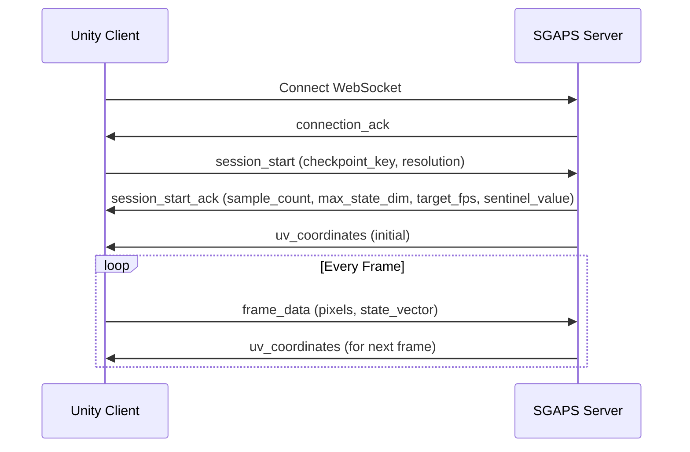

# SGAPS-MAE Unity Client

Sparse Game-Aware Pixel Sampling client for efficient game replay capture.

## Installation

### Via Unity Package Manager

1. Open Unity Package Manager (Window > Package Manager)
2. Click "+" and select "Add package from disk..."
3. Navigate to this folder and select `package.json`

### Dependencies

This package requires:

-   `com.unity.nuget.newtonsoft-json` (automatically installed)

## Quick Start

1. Add an empty GameObject to your scene
2. Add the `SGAPSManager` component
3. Configure the server endpoint (default: `ws://localhost:8000/ws/stream`)
4. Press Play and click Connect (or enable "Connect On Start")

## Components

### SGAPSManager

Main component that coordinates frame capture and server communication.

**Inspector Settings:**

-   **Server Endpoint**: WebSocket server URL
-   **Checkpoint Key**: Model identifier (per game/level)
-   **Connect On Start**: Automatically connect when scene starts
-   **Show Debug Panel**: Display connection status overlay

**Server-Controlled Parameters:**

The following parameters are controlled by the server and received via `session_start_ack`:

-   **Sample Count**: Number of pixels to sample per frame
-   **Max State Dim**: Maximum state vector dimension
-   **Target FPS**: Capture rate (must match server)
-   **Sentinel Value**: Padding value for unused state dimensions (handled by server)

### State Vector

Use the state vector to send game context to the server:

```csharp
// Get reference to SGAPSManager
SGAPSManager sgaps = GetComponent<SGAPSManager>();

// Set state values (reset each frame)
sgaps.SetState(0, player.transform.position.x);
sgaps.SetState(1, player.transform.position.y);
sgaps.SetState(2, player.health / player.maxHealth);
```

## Server Setup

The SGAPS server must be running before connecting:

```bash
cd v4/sgaps-server
pip install -r requirements.txt
python main.py
```

## Architecture

```
SGAPSManager
├── FrameCaptureHandler  - Captures final screen via ScreenCapture API
├── PixelSampler         - Samples pixels at UV coordinates
├── NetworkClient        - WebSocket communication
└── StateVectorCollector - Game state collection
```

## Protocol Flow



**session_start_ack contains (all server-controlled):**

-   `sample_count`: Number of pixels to sample
-   `max_state_dim`: State vector dimension
-   `target_fps`: Capture frame rate
-   `sentinel_value`: Padding for unused state dimensions
-   `resolution`: Confirmed screen resolution

## License

MIT License
